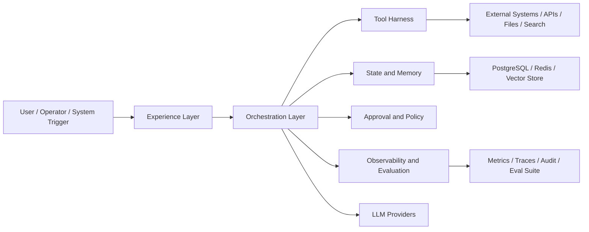
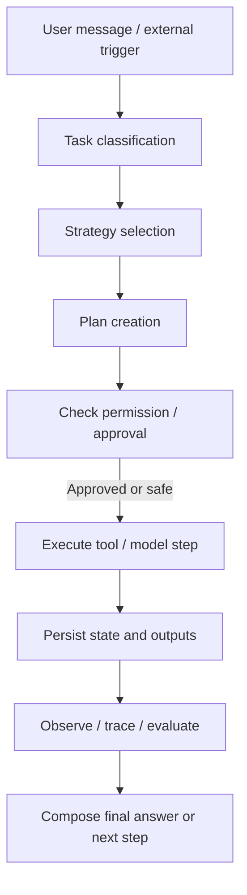
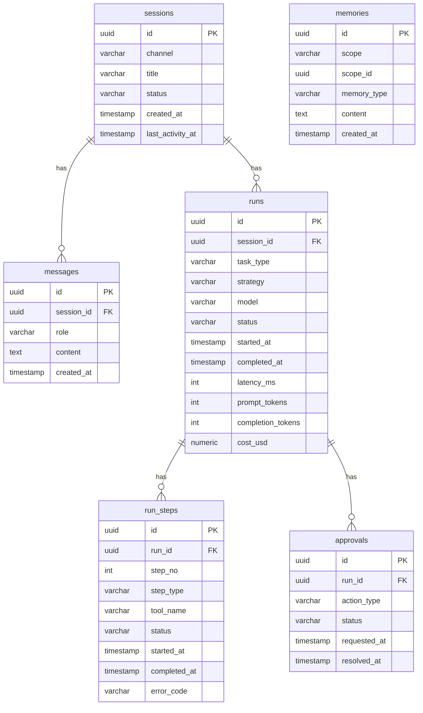
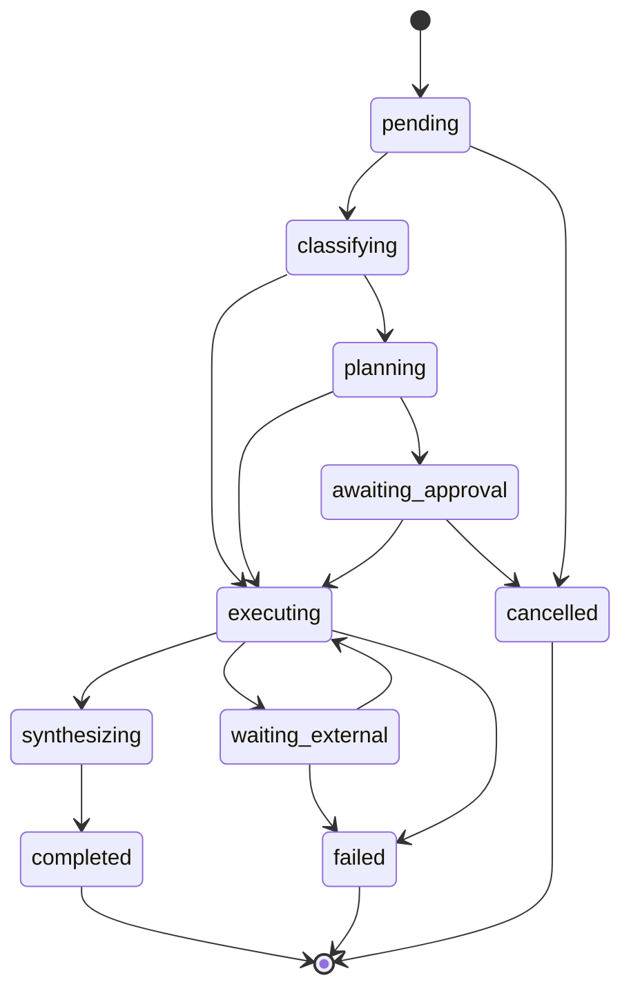

# 02. Harness Engineering cho hệ thống AI production

## 1. Mục tiêu

Tài liệu này gom lại phần kiến trúc, thiết kế kỹ thuật và lộ trình triển khai của **Harness Engineering** trong một tài liệu duy nhất.

Mục tiêu là trả lời 4 câu hỏi theo đúng logic triển khai:

1. Harness Engineering là gì và dùng để làm gì?
2. Hệ thống này gồm những thành phần nào?
3. Data model, luồng xử lý và cơ chế kiểm soát vận hành ra sao?
4. Nếu triển khai thực tế thì đi theo roadmap nào?

---

## 2. Harness Engineering là gì

Harness Engineering là lớp điều phối để hệ thống AI làm việc ổn định trong môi trường production.

Nó không chỉ là prompt engineering. Nó là tổ hợp của:

- orchestration,
- tool execution,
- memory,
- approval,
- policy,
- observability,
- evaluation,
- và reliability.

Nói ngắn gọn: nếu model là “bộ não”, thì harness là **khung vận hành** giúp bộ não đó làm việc đúng quy trình, đúng quyền hạn và có thể kiểm soát được.

---

## 3. Khi nào cần Harness Engineering

Harness Engineering cần thiết khi hệ thống AI không còn là demo hỏi đáp đơn giản mà đã bước sang bài toán production, ví dụ:

- AI phải gọi nhiều tool hoặc API ngoài
- AI cần làm việc nhiều bước và có state
- Có hành động nhạy cảm cần approval
- Cần lưu history, memory, audit, trace
- Cần kiểm soát cost, latency, error rate
- Cần replay, eval, và regression test sau mỗi lần thay đổi

---

## 4. Kiến trúc tổng thể

### 4.1. Ý nghĩa các lớp

- **Experience Layer**: nơi user tương tác qua web, Telegram, app, hoặc API
- **Orchestration Layer**: quyết định task đi theo strategy nào, step nào chạy trước, step nào cần chờ
- **Tool Harness**: lớp gọi tool có schema, timeout, retry, guardrail
- **State and Memory**: nơi lưu session, run, message, scratchpad, long-term memory
- **Approval and Policy**: chặn các hành động nhạy cảm và enforce permission
- **Observability and Evaluation**: giúp hệ thống đo được chất lượng, chi phí, lỗi và khả năng lặp lại

---

## 5. Luồng xử lý chuẩn

### 5.1. Diễn giải

1. Hệ thống nhận input từ user hoặc trigger tự động
2. Classifier xác định loại task
3. Router chọn strategy phù hợp
4. Planner chia task thành step nếu cần
5. Policy/approval gate kiểm tra rủi ro
6. Executor gọi model hoặc tool
7. State được lưu lại để có thể resume, audit, replay
8. Quan sát và đánh giá được ghi nhận song song
9. Hệ thống trả kết quả hoặc tiếp tục bước tiếp theo

---

## 6. Thành phần kỹ thuật cốt lõi

### 6.1. Session và Run

- **Session**: đại diện cho ngữ cảnh hội thoại hoặc luồng làm việc
- **Run**: một lần thực thi cụ thể của hệ thống cho một yêu cầu
- **Run Step**: từng bước nhỏ trong một run

### 6.2. Memory

Nên tách 3 lớp:

- **Conversation memory**: history của session
- **Working memory**: scratchpad ngắn hạn của 1 run
- **Long-term memory**: preference, fact, lesson có thể dùng lại về sau

### 6.3. Tool harness

Mỗi tool nên có:

- input schema
- output schema
- timeout
- retry policy
- permission requirement
- side-effect level

### 6.4. Approval layer

Approval nên áp dụng cho các hành động như:

- ghi file
- gửi message ra ngoài
- gọi API write
- chạy shell nhạy cảm
- hành động liên quan bảo mật hoặc tài chính

### 6.5. Observability

Tối thiểu phải có:

- trace theo run và step
- latency
- token usage
- cost
- error rate
- approval rate
- tool success/failure rate

---

## 7. Data model tối thiểu

### 7.1. Nguyên tắc thiết kế dữ liệu

- message là dữ liệu hội thoại
- run là dữ liệu thực thi
- step là dữ liệu trace kỹ thuật
- approval là dữ liệu kiểm soát rủi ro
- memory là dữ liệu hỗ trợ continuity

Không nên trộn tất cả vào một bảng lịch sử chung.

---

## 8. Run state machine

### 8.1. Ý nghĩa

State machine giúp:

- biết run đang ở đâu
- tránh transition sai
- resume được sau restart
- support audit và debugging tốt hơn

---

## 9. Checklist kỹ thuật để lên production

### 9.1. Lớp bắt buộc

- task classifier
- strategy router
- planner
- tool registry
- approval manager
- state persistence
- retry / timeout / circuit breaker
- queue / worker cho background run
- trace / metrics / audit log
- evaluation suite

### 9.2. Điều kiện tối thiểu để gọi là production-ready

- không block API thread với run dài
- có thể resume khi worker restart
- có tenant isolation nếu là multi-tenant
- có audit log cho external write
- có cost tracking theo model / user / tenant
- có replay được run cũ để debug regression

---

## 10. Lộ trình triển khai thực tế

### Giai đoạn 1 — Foundation

Mục tiêu:

- tạo session, run, run step
- gọi được model
- gọi được một số tool cơ bản
- lưu trace vào DB

Deliverable:

- chat flow end-to-end
- 2–3 tool có schema rõ ràng
- UI hiển thị session và run cơ bản

### Giai đoạn 2 — Orchestration và approval

Mục tiêu:

- classifier
- strategy router
- planner
- approval workflow
- state machine đầy đủ

Deliverable:

- multi-step task ổn định
- approve / deny hoạt động đúng

### Giai đoạn 3 — Reliability và memory

Mục tiêu:

- retry / timeout / circuit breaker
- queue worker
- checkpoint / resume
- tách conversation / working / long-term memory

Deliverable:

- run dài không làm nghẽn hệ thống
- restart worker không mất toàn bộ tiến trình

### Giai đoạn 4 — Observability và evaluation

Mục tiêu:

- OpenTelemetry
- metrics dashboard
- eval suite
- replay tool
- cost tracking

Deliverable:

- thấy rõ thay đổi nào làm chất lượng tốt hơn hoặc tệ hơn

### Giai đoạn 5 — Hardening

Mục tiêu:

- multi-tenant authz
- secret management
- immutable audit log
- sandbox cho shell / file action
- on-call runbook

Deliverable:

- đủ điều kiện cho production thật

---

## 11. Kết luận

Harness Engineering là lớp hạ tầng điều phối để AI đi từ mức demo sang mức production.

Giá trị thật của nó không nằm ở việc “gọi model thông minh hơn”, mà nằm ở chỗ:

- hệ thống có state,
- có kiểm soát,
- có thể audit,
- có thể đo,
- có thể replay,
- và có thể vận hành lâu dài mà không biến thành mớ prompt khó bảo trì.
