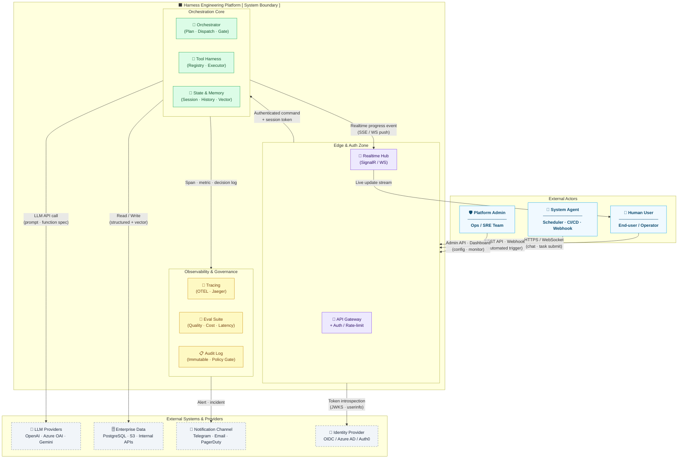
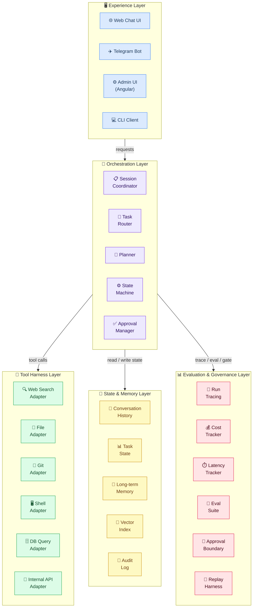

# 02a — Harness Engineering: Architecture Overview

## 1. Mục đích tài liệu

Tài liệu này giới thiệu kiến trúc tổng thể của Harness Engineering cho người mới tiếp cận hệ thống.
Mục tiêu: hiểu harness nằm ở đâu trong hệ thống lớn hơn, gồm những lớp nào, và dùng công nghệ gì.

---

## 2. Harness Engineering là gì

- Là khung điều phối (orchestration framework) để AI làm việc ổn định trong môi trường production
- Không chỉ là prompt engineering — là thiết kế hệ thống đầy đủ với state, policy, tool, memory, và eval
- Trả lời các câu hỏi: input nào hợp lệ, task được phân loại ra sao, tool nào được gọi, lỗi nào tự retry, hành động nào cần approval, chất lượng đầu ra được đo thế nào
- Giao điểm giữa: AI application architecture, distributed systems, platform engineering, observability, policy & safety, product workflow design

---

## 3. System Context Diagram

> **Scope:** Level-1 context map (C4 Model — Context View).  
> Mục đích: xác định **ai** tương tác với hệ thống, qua **kênh** nào, và hệ thống phụ thuộc vào **external system** nào.  
> Chi tiết internal component xem Section 4.

### Giải thích các zone

| Zone | Vai trò | Ranh giới bảo mật |
|---|---|---|
| **Edge & Auth** | Điểm vào duy nhất — xác thực, rate-limit, route | Public-facing, TLS terminated |
| **Orchestration Core** | Não của hệ thống — plan, dispatch, tool call, state | Internal network, không expose trực tiếp |
| **Observability & Governance** | Ghi lại mọi quyết định, đo chất lượng, policy gate | Read-only từ Core; write đến external alerting |
| **External Systems** | LLM, database, notification, identity — nằm ngoài system boundary | Giao tiếp qua adapter, không hardcode credential |

---

## 4. Component Diagram

---

## 5. Technology Stack Table

Bảng dưới tóm tắt **loại công nghệ** và **team chịu trách nhiệm** cho từng layer.  
Chi tiết lựa chọn cụ thể (version, config) xem tài liệu `02b_infrastructure_setup.md`.

| Layer | Vai trò chính | Công nghệ tiêu biểu | Owner |
|---|---|---|---|
| **Experience** | UI, realtime channel, bot | Angular, SignalR, Telegram Bot API | Frontend / Product |
| **Orchestration** | API, session, background worker | ASP.NET Core, .NET BackgroundService | Backend |
| **Tool Harness** | Adapter registry, tool execution | ASP.NET Core + JSON Schema validation | Backend / Platform |
| **State & Memory** | Persistent state, cache, vector search | PostgreSQL, Redis, pgvector / Qdrant | Platform / Data |
| **Evaluation & Governance** | Tracing, metrics, audit log | OpenTelemetry, Prometheus, Grafana | SRE / Platform |
| **LLM Integration** | Model adapter, prompt dispatch | OpenAI SDK / Azure OpenAI SDK | AI/ML Engineer |

---

## 6. Khi nào dùng LLM, khi nào dùng code

> **Nguyên tắc cốt lõi:** Dùng code cho mọi thứ có thể xác định trước (deterministic). Dùng LLM chỉ khi cần reasoning, language understanding, hoặc judgment mà code không thể hardcode được.

### Heuristic nhanh

| Câu hỏi | Trả lời → dùng |
|---|---|
| Output có thể viết thành `if/else` hay rule rõ ràng không? | ✅ Code |
| Output phụ thuộc vào ngữ nghĩa / ngữ cảnh tự nhiên không? | ✅ LLM |
| Sai lầm ở đây có side effect nghiêm trọng không (xoá dữ liệu, gửi tiền...)? | ✅ Code kiểm soát, LLM chỉ đề xuất |
| Cần kết quả 100% nhất quán và auditable không? | ✅ Code |

### Ví dụ áp dụng trong hệ thống

| Tình huống | Xử lý bằng |
|---|---|
| Validate input schema, enforce timeout, check permission | Code |
| Route task theo rule cố định, tính cost/latency/token | Code |
| Ghi audit log, persist state, trigger approval gate | Code |
| Phân loại intent của user request | LLM |
| Decompose task thành các bước, sinh execution plan | LLM |
| Tổng hợp kết quả từ nhiều tool, viết summary cho người dùng | LLM |
| Đánh giá chất lượng output (model-graded eval) | LLM |

> Chi tiết decision framework cho từng use case xem `02c_llm_vs_code_decision_guide.md`.
