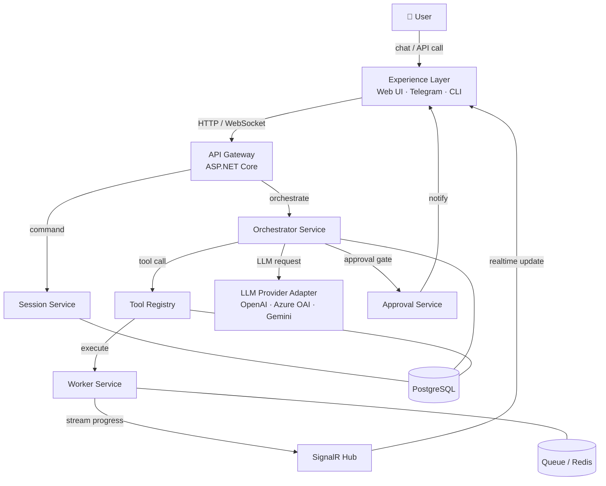
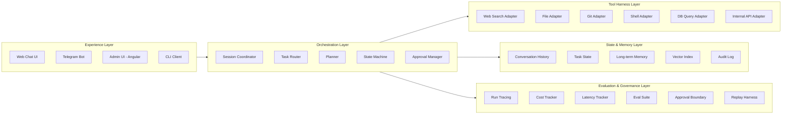

# 02a — Harness Engineering: Architecture Overview

## 1. Mục đích tài liệu

Tài liệu này giới thiệu kiến trúc tổng thể của Harness Engineering cho người mới tiếp cận hệ thống.
Mục tiêu: hiểu harness nằm ở đâu trong hệ thống lớn hơn, gồm những lớp nào, và dùng công nghệ gì.

---

## 2. Harness Engineering là gì

- Là khung điều phối (orchestration framework) để AI làm việc ổn định trong môi trường production
- Không chỉ là prompt engineering — là thiết kế hệ thống đầy đủ với state, policy, tool, memory, và eval
- Trả lời các câu hỏi: input nào hợp lệ, task được phân loại ra sao, tool nào được gọi, lỗi nào tự retry, hành động nào cần approval, chất lượng đầu ra đo bằng gì
- Giao điểm giữa: AI application architecture, distributed systems, platform engineering, observability, policy & safety, product workflow design

---

## 3. System Context Diagram

---

## 4. Component Diagram

---

## 5. Technology Stack Table

| Layer | Component | Technology |
|---|---|---|
| Experience | Web Chat UI | Angular |
| Experience | Realtime Push | SignalR (ASP.NET Core) |
| Experience | Bot Channel | Telegram Bot API |
| Orchestration | API Gateway | ASP.NET Core Web API |
| Orchestration | Session & Run Service | ASP.NET Core + EF Core |
| Orchestration | Background Worker | .NET BackgroundService |
| Orchestration | Message Queue | Redis Streams / RabbitMQ / Kafka |
| Tool Harness | Tool Registry | ASP.NET Core + JSON Schema validation |
| Tool Harness | File / Object Storage | S3-compatible / Local |
| State & Memory | Primary Database | PostgreSQL |
| State & Memory | Cache & Pub/Sub | Redis |
| State & Memory | Vector Search | pgvector / Qdrant |
| Evaluation & Governance | Tracing | OpenTelemetry + Jaeger |
| Evaluation & Governance | Metrics | Prometheus + Grafana |
| LLM Provider | Adapter | OpenAI SDK / Azure OpenAI SDK |

---

## 6. Khi nào dùng LLM, khi nào dùng code

| Deterministic — dùng code | Non-deterministic — dùng LLM |
|---|---|
| Validate input schema | Phân loại task (classify intent) |
| Enforce timeout và retry policy | Decompose task thành các bước |
| Check permission và side effect level | Sinh execution plan |
| Route task dựa trên rule rõ ràng | Tổng hợp kết quả từ nhiều tool |
| Tính cost, latency, token count | Viết draft answer hoặc summary |
| Ghi audit log | Đánh giá chất lượng output (model-graded eval) |
| Trigger approval gate | Lý giải lý do fail cho người dùng |
| Persist state vào database | Quyết định bước tiếp theo trong plan-and-execute |
| Schema migration, index maintenance | Rút ra memory đáng lưu từ conversation |
