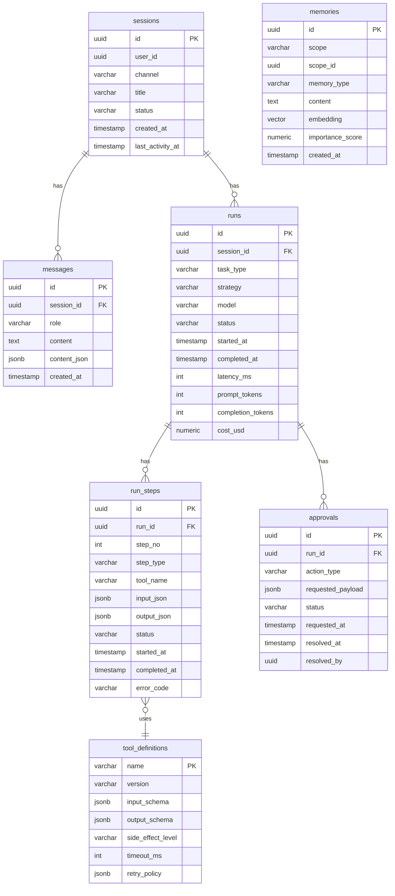
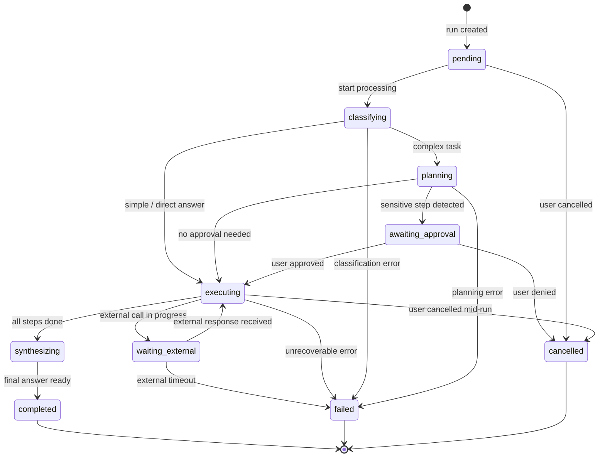
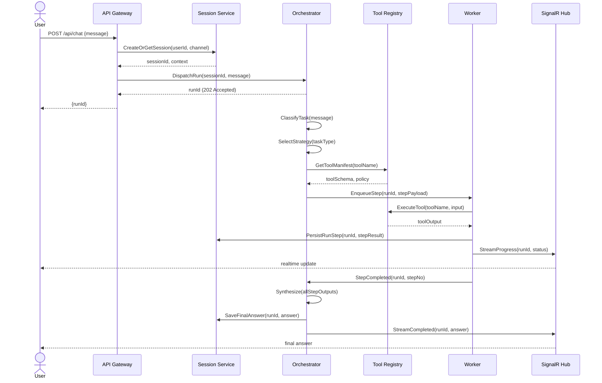
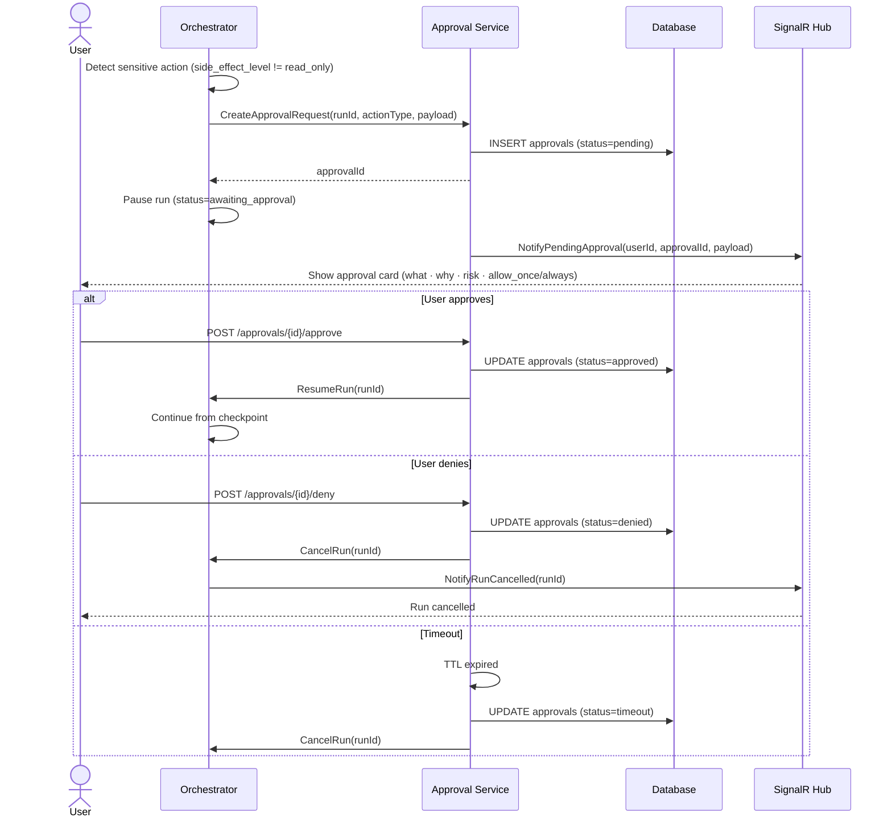

# 02b — Harness Engineering: Technical Design Specification

## 1. Mục đích tài liệu

Tài liệu này định nghĩa data model, state machine, sequence flow, tool contract, và error catalog đủ để implement và review kiến trúc.
Đây là nguồn tham chiếu kỹ thuật — không phải tài liệu giải thích khái niệm.

---

## 2. Data Model / ERD



---

## 3. Run State Machine



---

## 4. Sequence Diagram — Luồng cơ bản



---

## 5. Tool Contract Specification

### Các field bắt buộc

| Field | Type | Mô tả |
|---|---|---|
| `name` | string | Tên duy nhất của tool, snake_case |
| `description` | string | Mô tả ngắn cho LLM hiểu khi nào dùng tool này |
| `input_schema` | JSON Schema | Schema validate input trước khi gọi tool |
| `output_schema` | JSON Schema | Schema mô tả cấu trúc output trả về |
| `timeout_ms` | int | Timeout tối đa cho một lần gọi |
| `retry_policy` | object | `max_attempts`, `backoff_ms`, `retry_on` |
| `idempotency` | bool | `true` nếu gọi lại với cùng input cho cùng kết quả |
| `side_effect_level` | enum | `read_only` / `workspace_write` / `external_write` / `destructive` |
| `required_permissions` | string[] | Danh sách permission scope cần có |

### Ví dụ JSON — `web_search`

```json
{
  "name": "web_search",
  "description": "Search the public web and return top results with title, url, and snippet.",
  "input_schema": {
    "type": "object",
    "properties": {
      "query": { "type": "string", "maxLength": 256 },
      "max_results": { "type": "integer", "default": 5, "maximum": 10 }
    },
    "required": ["query"]
  },
  "output_schema": {
    "type": "array",
    "items": {
      "type": "object",
      "properties": {
        "title": { "type": "string" },
        "url": { "type": "string", "format": "uri" },
        "snippet": { "type": "string" }
      }
    }
  },
  "timeout_ms": 10000,
  "retry_policy": {
    "max_attempts": 2,
    "backoff_ms": 1000,
    "retry_on": ["timeout", "rate_limit"]
  },
  "idempotency": true,
  "side_effect_level": "read_only",
  "required_permissions": ["web:read"]
}
```

---

## 6. Tool Side Effect Classification

| Level | Mô tả | Ví dụ tool |
|---|---|---|
| `read_only` | Chỉ đọc, không thay đổi bất kỳ trạng thái nào | `web_search`, `file_read`, `db_query_select` |
| `workspace_write` | Ghi vào workspace nội bộ (file local, DB nội bộ) | `file_write`, `create_draft`, `save_note` |
| `external_write` | Gọi API bên ngoài có ghi dữ liệu | `send_email`, `post_slack`, `github_push`, `api_post` |
| `destructive` | Xóa hoặc thay đổi không thể hoàn tác | `delete_file`, `drop_table`, `cancel_payment`, `shell_rm` |

---

## 7. Task Routing Strategy

| Strategy | Dùng khi | Ưu điểm | Nhược điểm |
|---|---|---|---|
| **Direct Answer** | Hỏi đáp ngắn, giải thích khái niệm, format nhẹ | Nhanh, rẻ, ít lỗi điều phối | Không có tool call, không dùng được dữ liệu mới |
| **Tool-Assisted Answer** | Cần web search, đọc file, query DB, dữ liệu realtime | Chính xác hơn, giảm hallucination | Chậm hơn direct, cần tool schema chuẩn |
| **Plan-and-Execute** | Task nhiều bước, coding, refactor, migration, audit | Kiểm soát tốt, trace tốt, retry từng bước | Latency cao hơn, tốn token hơn |
| **Multi-Agent** | Research phức tạp, review chéo, pipeline chuyên môn hóa | Xử lý song song, chuyên sâu từng agent | Tốn tiền, tăng latency, tăng complexity — chỉ dùng khi single-agent đã ổn |

---

## 8. Error Code Catalog

| error_code | Mô tả | Hành động xử lý |
|---|---|---|
| `validation_error` | Input không đúng schema | Trả lỗi ngay cho client, không retry |
| `permission_denied` | User hoặc tenant thiếu permission | Trả 403, log audit, không retry |
| `tool_timeout` | Tool vượt `timeout_ms` | Retry theo `retry_policy`, sau đó fail step |
| `tool_unavailable` | Tool service không phản hồi | Circuit breaker, fallback hoặc fail run |
| `dependency_failed` | Bước phụ thuộc trước đó failed | Fail cả run hoặc skip tùy config |
| `rate_limit` | LLM provider hoặc tool trả 429 | Exponential backoff, retry |
| `context_overflow` | Prompt vượt context window của model | Truncate hoặc summarize context rồi retry |
| `approval_timeout` | Approval request không được giải quyết trong TTL | Tự động cancel run, notify user |
| `approval_denied` | User deny action | Cancel run step, log audit trail |
| `external_api_error` | External API trả lỗi 5xx | Retry nếu idempotent, fail nếu không |
| `memory_write_error` | Không ghi được vào memory store | Log warning, tiếp tục run không lưu memory |
| `model_error` | LLM trả lỗi hoặc output không parse được | Retry một lần với prompt đơn giản hơn |

---

## 9. Approval Flow Sequence



---

## 10. Memory Type Comparison

| Type | Scope | TTL | Dùng khi | Lưu ở đâu |
|---|---|---|---|---|
| **Conversation Memory** | Session | Hết session | Giữ coherence trong hội thoại ngắn | `messages` table (PostgreSQL) |
| **Working Memory** | Run | Hết run | Scratchpad, intermediate output, planning state | `run_steps` + Redis (ephemeral) |
| **Long-term Memory** | User / Project | Vĩnh cửu hoặc review định kỳ | Preference, facts bền, lessons learned, playbook | `memories` table (PostgreSQL) |
| **Retrieval Memory** | Global / Tenant | Quản lý bằng policy | Semantic recall từ knowledge base lớn | pgvector / Qdrant |
