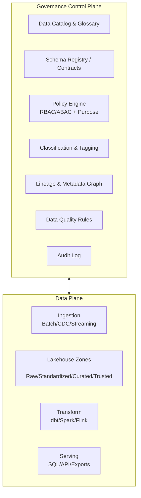
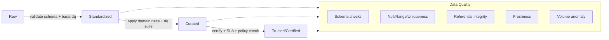
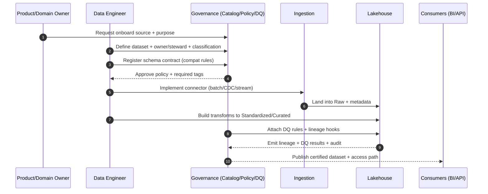
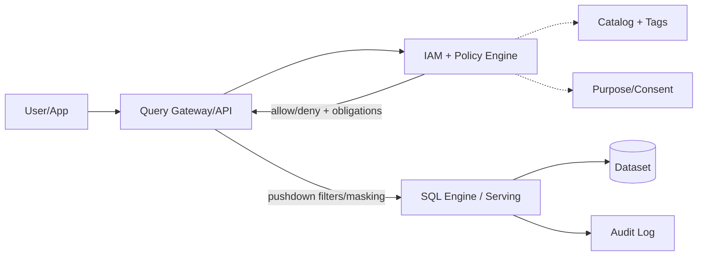
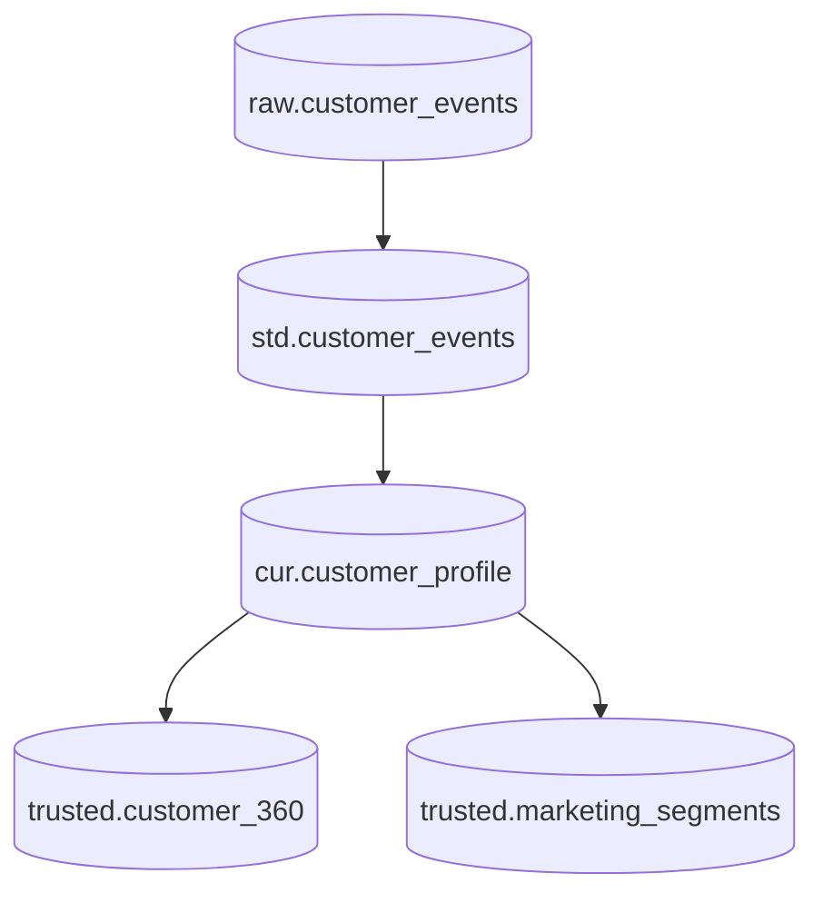
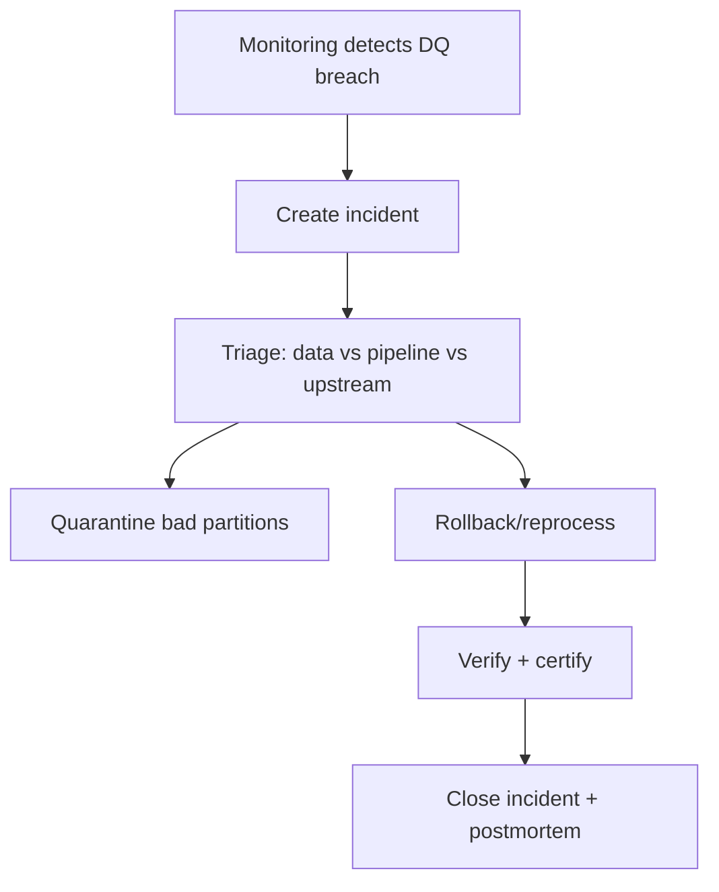

# Data Governance Design (Data-only)

## Executive Summary

Tài liệu này mô tả **thiết kế Data Governance cho riêng domain dữ liệu** (không bàn về AI harness/agents), theo hướng “governance như control-plane”:

- Chuẩn hoá cách **định nghĩa dữ liệu** (glossary + schema + contracts)
- Chuẩn hoá **quyền truy cập** (policy, classification, masking)
- Chuẩn hoá **chất lượng dữ liệu** (DQ rules, SLAs, gates)
- Theo dõi **lineage** end-to-end (ingestion → transform → consumption)
- Đảm bảo **audit/compliance** (who/what/when/why)

Mục tiêu là dữ liệu “đủ tin” để:

- Vận hành (operational analytics)
- Báo cáo (BI)
- Phục vụ sản phẩm (data products / APIs)

---

## 1. Governance as Control Plane

### 1.1. Data-plane vs Control-plane

**Ý nghĩa thiết kế**:

- Data-plane tối ưu cho throughput/latency/cost.
- Control-plane định nghĩa “luật chơi” (metadata/policy/quality) áp lên data-plane.
- Mọi thao tác tạo/đọc/biến đổi dữ liệu đều “đi qua” governance bằng metadata, chứ không phải bằng hand-check.

---

## 2. Data Governance Domains

### 2.1. Metadata Model tối thiểu

Khuyến nghị metadata tối thiểu để governance chạy được end-to-end:

- **Data Asset**: dataset/table/topic/file/object
- **Owner & Steward**: accountable + operational
- **Classification**: Public/Internal/Confidential/Restricted (tuỳ tổ chức)
- **PII / Sensitive tags**: email, phone, national_id, health, finance...
- **Contracts**: schema + constraints + compatibility
- **SLA/SLO**: freshness, completeness, availability, accuracy
- **Lineage**: upstream/downstream + transform job id
- **Access policy**: who can access + purpose + conditions

### 2.2. RACI gợi ý

| Domain | Responsible | Accountable | Consulted | Informed |
|---|---|---|---|---|
| Glossary term | Data Steward | Domain Owner | SMEs | Consumers |
| Dataset contract | Data Engineer | Domain Owner | Security/Compliance | Consumers |
| Access policy | Security | Data Owner | Legal/Compliance | Platform |
| DQ rules | Data Engineer | Domain Owner | Analysts | Consumers |

---

## 3. Lakehouse Zones + Governance Gates

### 3.1. Zones (nhìn theo governance)

- **Raw**: immutable, retain dài, quyền hạn chế
- **Standardized**: schema ổn định, basic DQ, chuẩn hoá naming/types
- **Curated**: áp business rules, domain model, join/enrich
- **Trusted/Certified**: data product chính thức, có SLA, có chứng nhận

### 3.2. Quality Gate mẫu

**Nguyên tắc**:

- Không đưa dữ liệu lên zone cao hơn nếu chưa đạt gate.
- Gate là **code + policy**, không phải checklist thủ công.
- Mọi failures phải có **quarantine** + **triage workflow**.

---

## 4. Data Lifecycle Flows

### 4.1. Onboarding một Data Source

Deliverables tối thiểu khi onboard:

- Dataset entry trong catalog (owner, steward, description)
- Classification + sensitive tags
- Schema contract + compatibility strategy
- DQ suite + thresholds (SLA/SLO)
- Lineage capture (job → outputs)
- Access policy (RBAC/ABAC + purpose)

### 4.2. Access một Dataset (SQL/API)

**Key point**: policy engine có thể trả về **obligations** (masking, row-level filters, rate limit) chứ không chỉ allow/deny.

---

## 5. Lineage: mức “đủ dùng” và mức “chuẩn”

### 5.1. Mức đủ dùng (pragmatic)

- Lineage theo dataset-level: `upstream datasets -> downstream datasets`
- Gắn với `job_run_id` + timestamp + code version (git sha)

### 5.2. Mức chuẩn (ideal)

- Column-level lineage (nhất là trường PII)
- Transform graph đầy đủ (SQL parse / Spark plan)

---

## 6. Policy, Classification, Masking

### 6.1. Data classification mẫu

- **Public**: chia sẻ công khai
- **Internal**: nội bộ, không nhạy cảm
- **Confidential**: nhạy cảm, cần kiểm soát
- **Restricted**: tối nhạy cảm, kiểm soát nghiêm ngặt

### 6.2. Policy patterns

- **RBAC**: theo role (analyst, engineer, service)
- **ABAC**: theo attributes (tenant, region, clearance)
- **Purpose-based**: theo purpose (billing, support, marketing)
- **Time-bound access**: grant theo thời hạn + ticket

### 6.3. Masking patterns

- Tokenization / reversible encryption (khi cần join)
- Irreversible hashing (khi không cần restore)
- Partial masking (email/phone)
- Row-level security theo tenant/region

---

## 7. Data Quality & Observability

### 7.1. DQ rule taxonomy

- **Validity**: range, regex, type
- **Completeness**: null rate, missing partitions
- **Uniqueness**: primary key uniqueness
- **Consistency**: cross-table consistency
- **Timeliness**: freshness/lag
- **Accuracy**: reconcile với nguồn chuẩn (khi có)

### 7.2. Incident workflow

---

## 8. Implementation Notes (mapping vào repo này)

- Tài liệu kiến trúc tổng quan: `README.md`
- Tài liệu platform/IoMT: `01_iomt_platform_technical_architecture.md`
- Tài liệu harness engineering: `02_harness_engineering.md`

Tài liệu này (`03_data_governance_design.md`) tách riêng phần governance cho data để dễ dùng như “design doc” khi triển khai catalog/policy/quality/lineage.

