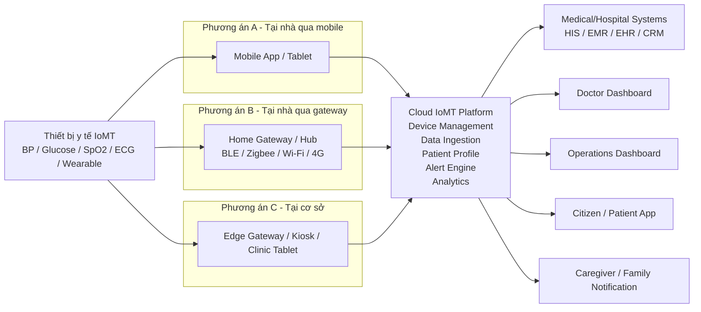
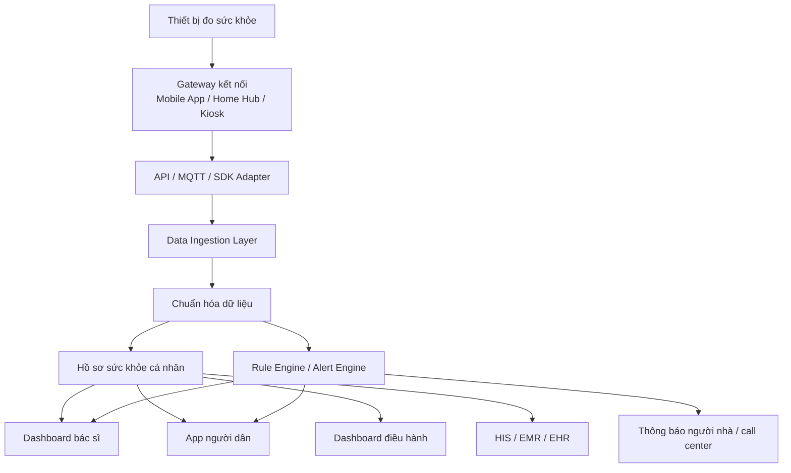
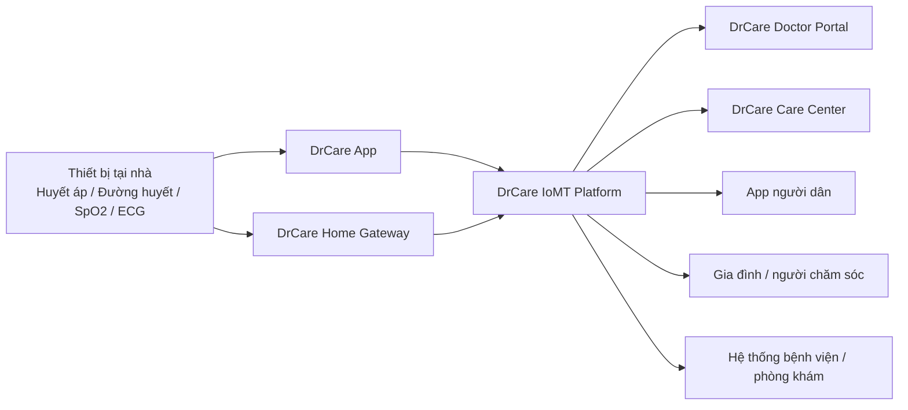

# 03. Kiến trúc kết nối IoMT cho DrCare

## 1. Mục tiêu

Tài liệu này mô tả mô hình kết nối triển khai hệ thống **IoMT (Internet of Medical Things)** cho bài toán **khám sức khỏe (KSK), theo dõi chủ động và quản lý bệnh mạn tính** cho người dân.

Mục tiêu của kiến trúc là:

- Thu thập dữ liệu từ các thiết bị y tế tại nhà hoặc tại điểm khám
- Đồng bộ dữ liệu về nền tảng trung tâm
- Phân tích xu hướng và phát hiện bất thường sớm
- Cung cấp dashboard cho bác sĩ, điều hành và ứng dụng cho người dân
- Sẵn sàng tích hợp với hệ thống bệnh viện/phòng khám trong tương lai

---

## 2. Sơ đồ tổng thể

---

## 3. Sơ đồ luồng dữ liệu và cảnh báo

---

## 4. Sơ đồ định hướng DrCare

---

## 5. Giải thích ngắn gọn

### 5.1. Lớp thiết bị

Bao gồm các thiết bị y tế có khả năng kết nối như:

- Máy đo huyết áp
- Máy đo đường huyết
- Máy đo SpO2
- Thiết bị ECG
- Đồng hồ/wearable theo dõi nhịp tim, giấc ngủ, vận động

### 5.2. Lớp gateway kết nối

Đây là lớp trung gian nhận dữ liệu từ thiết bị và đẩy lên nền tảng trung tâm:

- **Mobile App**: phù hợp cho người dùng cá nhân, triển khai nhanh và chi phí thấp
- **Home Gateway / Hub**: phù hợp cho người cao tuổi, giảm phụ thuộc vào thao tác điện thoại
- **Kiosk / Clinic Tablet / Edge Gateway**: phù hợp cho điểm KSK cộng đồng, nhà thuốc, phòng khám, doanh nghiệp

### 5.3. Nền tảng IoMT trung tâm

Nền tảng trung tâm cần có các năng lực cốt lõi:

- Quản lý thiết bị
- Tiếp nhận dữ liệu từ nhiều nguồn
- Chuẩn hóa dữ liệu y tế
- Lưu hồ sơ sức khỏe cá nhân
- Phân tích xu hướng
- Sinh cảnh báo bất thường
- Tích hợp với dashboard và hệ thống ngoài

### 5.4. Lớp sử dụng nghiệp vụ

Dữ liệu sau khi được xử lý sẽ phục vụ cho:

- **Bác sĩ**: theo dõi chỉ số, lịch sử và cảnh báo sớm
- **Điều hành**: theo dõi hiệu quả chương trình KSK, nhóm nguy cơ, tỷ lệ tuân thủ đo
- **Người dân**: xem chỉ số, xu hướng và nhận nhắc nhở
- **Người nhà/caregiver**: nhận cảnh báo khi có dấu hiệu bất thường

---

## 6. Khuyến nghị lộ trình triển khai

### Giai đoạn 1

Triển khai mô hình:

**Thiết bị -> Mobile App -> Cloud**

Phù hợp để chạy nhanh, chi phí thấp, dễ pilot.

### Giai đoạn 2

Mở rộng thêm mô hình:

**Thiết bị -> Home Gateway -> Cloud**

Phù hợp cho người cao tuổi, hộ gia đình và các ca cần theo dõi ổn định hơn.

### Giai đoạn 3

Mở rộng cho doanh nghiệp và cơ sở y tế:

**Thiết bị / Kiosk -> Edge Gateway -> Cloud / HIS**

Phù hợp cho KSK tập trung, screening cộng đồng và tích hợp quy trình khám.

---

## 7. Kết luận

Kiến trúc IoMT cho DrCare nên được thiết kế theo hướng nhiều lớp, linh hoạt theo từng đối tượng sử dụng.

Trọng tâm không chỉ là kết nối thiết bị, mà là xây dựng một nền tảng đủ khả năng:

- thu thập dữ liệu đáng tin cậy,
- phát hiện sớm nguy cơ,
- hỗ trợ bác sĩ can thiệp,
- và tạo trải nghiệm KSK chủ động cho người dân.
