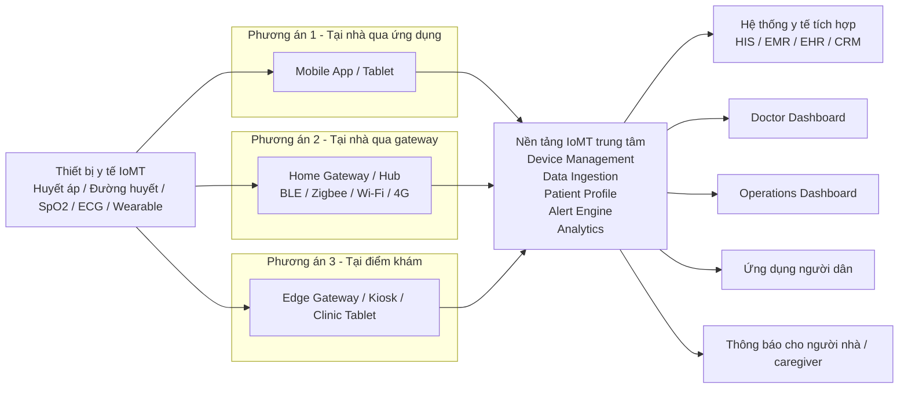
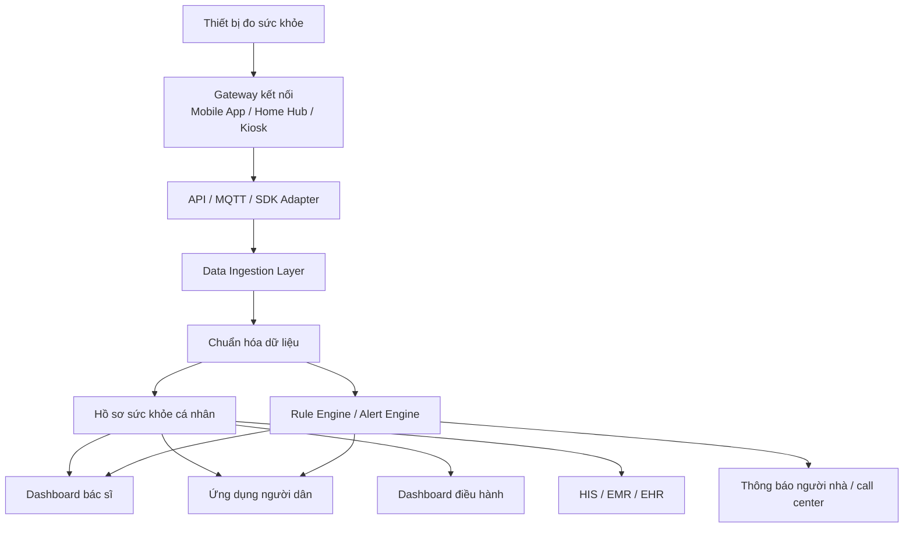

# 03. Kiến trúc kết nối IoMT cho hệ thống khám sức khỏe

## 1. Mục tiêu

Tài liệu này mô tả mô hình kết nối IoMT cho bài toán **khám sức khỏe, theo dõi sức khỏe chủ động và quản lý bệnh mạn tính**.

Mục tiêu của kiến trúc là:

- thu thập dữ liệu từ thiết bị y tế tại nhà hoặc tại điểm đo,
- đồng bộ dữ liệu về nền tảng trung tâm,
- phát hiện sớm bất thường,
- hỗ trợ bác sĩ, điều hành và người dân cùng sử dụng dữ liệu,
- sẵn sàng mở rộng lên quy mô lớn hơn ở giai đoạn production.

---

## 2. Mô hình kết nối tổng thể

---

## 3. Logic triển khai theo lớp

Kiến trúc này nên được hiểu theo 4 lớp chính:

### 3.1. Lớp thiết bị đo

Bao gồm:

- máy đo huyết áp,
- máy đo đường huyết,
- máy đo SpO2,
- thiết bị ECG,
- đồng hồ hoặc wearable theo dõi nhịp tim, vận động, giấc ngủ.

Đây là lớp tạo ra dữ liệu gốc.

### 3.2. Lớp gateway kết nối

Đây là lớp trung gian nhận dữ liệu từ thiết bị và đưa dữ liệu lên hệ thống trung tâm.

Có 3 cách triển khai phổ biến:

- **Mobile App / Tablet**: phù hợp cho người dùng cá nhân, chi phí thấp, triển khai nhanh
- **Home Gateway / Hub**: phù hợp cho người cao tuổi, giảm phụ thuộc vào điện thoại
- **Kiosk / Clinic Gateway**: phù hợp cho nhà thuốc, phòng khám, doanh nghiệp, trạm y tế

### 3.3. Lớp nền tảng trung tâm

Đây là lớp xử lý nghiệp vụ chính, bao gồm:

- quản lý thiết bị,
- tiếp nhận dữ liệu,
- chuẩn hóa dữ liệu,
- lưu hồ sơ sức khỏe,
- phân tích xu hướng,
- phát hiện bất thường,
- sinh cảnh báo.

### 3.4. Lớp sử dụng nghiệp vụ

Dữ liệu đã xử lý sẽ phục vụ cho:

- **bác sĩ** theo dõi chỉ số và đưa ra tư vấn,
- **bộ phận điều hành** theo dõi chương trình KSK,
- **người dân** xem lịch sử và nhận nhắc nhở,
- **người nhà/caregiver** nhận cảnh báo khi có dấu hiệu bất thường.

---

## 4. Sơ đồ luồng dữ liệu và cảnh báo

### 4.1. Diễn giải luồng

1. Thiết bị sinh ra measurement
2. Gateway nhận và đẩy dữ liệu lên nền tảng
3. Ingestion layer nhận dữ liệu và kiểm tra định dạng
4. Dữ liệu được chuẩn hóa về model thống nhất
5. Dữ liệu được ghi vào hồ sơ sức khỏe cá nhân
6. Rule engine kiểm tra ngưỡng và xu hướng
7. Nếu có dấu hiệu bất thường, hệ thống phát cảnh báo cho đúng nhóm sử dụng

---

## 5. Ba mô hình triển khai phù hợp theo bối cảnh

### 5.1. Mô hình A — Device -> Mobile App -> Cloud

**Phù hợp với:** cá nhân, hộ gia đình, pilot nhanh

**Ưu điểm:**
- chi phí thấp
- dễ triển khai
- tốc độ đưa sản phẩm ra thị trường nhanh

**Nhược điểm:**
- phụ thuộc điện thoại người dùng
- dễ phát sinh lỗi đồng bộ nếu UX kém

### 5.2. Mô hình B — Device -> Home Gateway -> Cloud

**Phù hợp với:** người cao tuổi, theo dõi tại nhà dài hạn

**Ưu điểm:**
- ổn định hơn
- ít phụ thuộc thao tác người dùng
- phù hợp monitoring định kỳ

**Nhược điểm:**
- tăng chi phí thiết bị
- tăng độ phức tạp vận hành

### 5.3. Mô hình C — Device/Kiosk -> Facility Gateway -> Cloud/HIS

**Phù hợp với:** doanh nghiệp, phòng khám, trạm y tế, screening cộng đồng

**Ưu điểm:**
- quản lý tập trung
- dễ tích hợp quy trình KSK
- phù hợp triển khai số lượng lớn theo chương trình

**Nhược điểm:**
- cần hạ tầng tại điểm triển khai
- cần tích hợp sâu hơn với hệ thống hiện có

---

## 6. Khuyến nghị lộ trình triển khai

### Giai đoạn 1

Bắt đầu với:

**Thiết bị -> Mobile App -> Cloud**

Lý do:
- nhanh nhất
- rẻ nhất
- phù hợp để pilot nghiệp vụ và kiểm tra adoption

### Giai đoạn 2

Mở rộng thêm:

**Thiết bị -> Home Gateway -> Cloud**

Lý do:
- phù hợp cho người cao tuổi
- phù hợp use case cần monitoring ổn định hơn

### Giai đoạn 3

Mở rộng cho tổ chức:

**Thiết bị / Kiosk -> Gateway tại cơ sở -> Cloud / HIS**

Lý do:
- phù hợp KSK doanh nghiệp
- phù hợp cộng đồng hoặc tuyến y tế cơ sở
- tạo nền tảng cho tích hợp hệ thống y tế lớn hơn

---

## 7. Những điểm phải tính ngay từ đầu

- bảo mật dữ liệu y tế
- xác thực thiết bị và gateway
- chuẩn hóa dữ liệu từ nhiều hãng thiết bị
- retry/offline sync khi mất mạng
- độ tin cậy của cảnh báo
- khả năng tích hợp HIS/EMR/EHR về sau

---

## 8. Kết luận

Mô hình kết nối IoMT cho khám sức khỏe không nên bị hiểu đơn giản là “thiết bị gửi dữ liệu lên app”.

Về bản chất, đây là một kiến trúc nhiều lớp gồm:

- thiết bị,
- lớp kết nối,
- nền tảng dữ liệu trung tâm,
- và lớp sử dụng nghiệp vụ.

Nếu thiết kế đúng từ đầu, mô hình này có thể bắt đầu từ pilot nhỏ và mở rộng dần lên production quy mô lớn hơn mà không phải đập đi làm lại toàn bộ.
