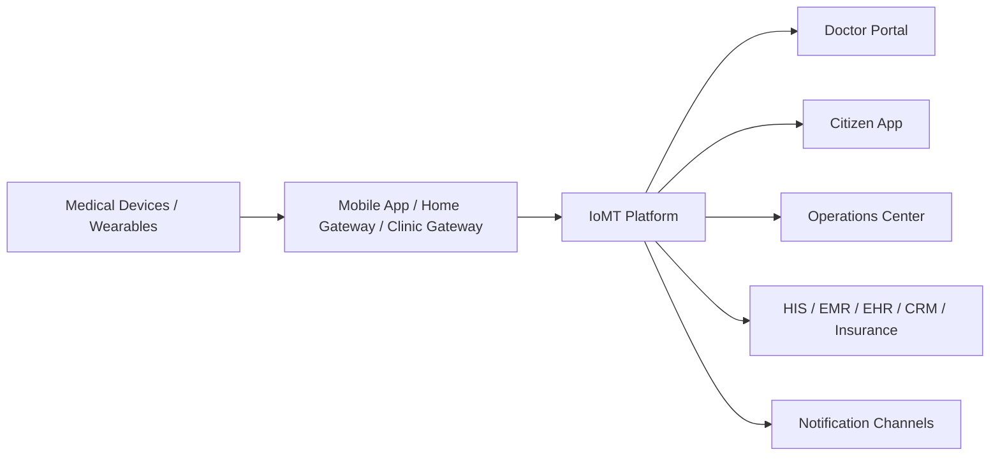
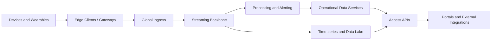
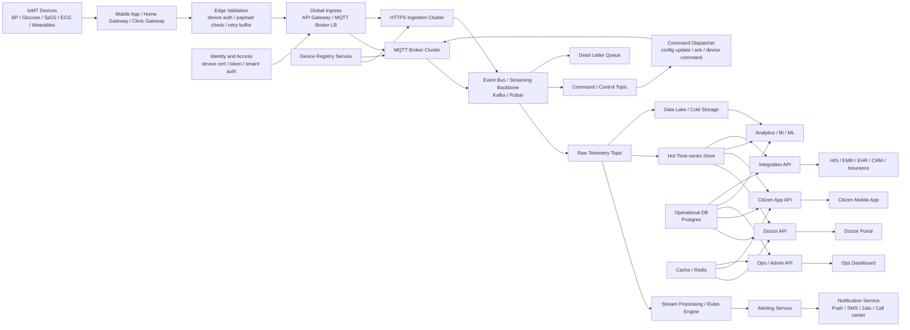
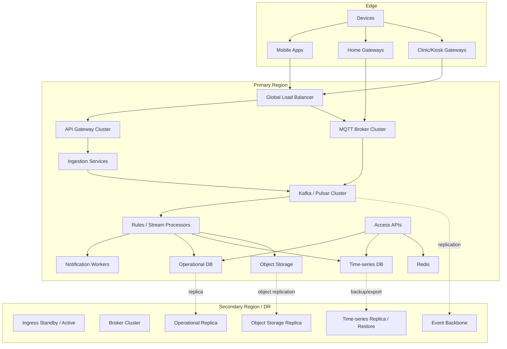
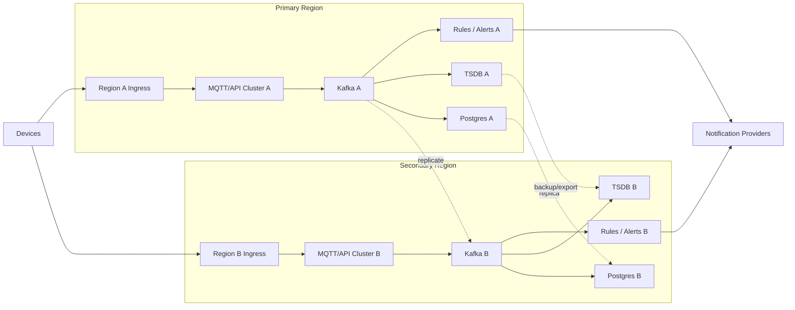

# 03. Technical Architecture — Nền tảng IoMT cho hệ thống khám sức khỏe quy mô lớn

## 1. Document Purpose

Tài liệu này mô tả kiến trúc kỹ thuật mục tiêu cho một nền tảng IoMT phục vụ:

- khám sức khỏe định kỳ,
- theo dõi sức khỏe chủ động,
- quản lý bệnh mạn tính,
- cảnh báo bất thường gần real-time,
- tích hợp với hệ sinh thái bệnh viện, phòng khám, bảo hiểm và hệ thống điều hành.

Đây là **technical architecture document** ở cấp độ solution / platform architecture, hướng tới hệ thống có khả năng phục vụ **hàng triệu người dùng và hàng triệu thiết bị**.

Tài liệu tập trung vào:

- kiến trúc logic,
- kiến trúc runtime,
- kiến trúc triển khai,
- các quyết định kiến trúc trọng yếu,
- non-functional requirements,
- rủi ro kỹ thuật và cơ chế giảm thiểu.

---

## 2. Scope

### 2.1. In scope

- device connectivity cho thiết bị y tế tại nhà, wearable, kiosk, gateway
- ingestion pipeline cho telemetry và command/control
- nền tảng xử lý sự kiện và alerting
- data platform cho operational data, time-series data, cold storage
- API layer cho doctor portal, citizen app, operations, integration
- bảo mật, quan sát, HA/DR, partitioning, capacity model ở mức kiến trúc

### 2.2. Out of scope

- chi tiết UI/UX của ứng dụng người dùng
- thiết kế cụ thể của từng màn hình bác sĩ hoặc điều hành
- chi tiết thuật toán ML/AI cho risk scoring
- lựa chọn vendor cuối cùng cho mọi thành phần hạ tầng
- đặc tả pháp lý và hồ sơ tuân thủ theo từng quốc gia

---

## 3. Architecture Drivers

### 3.1. Business drivers

- cung cấp dịch vụ khám sức khỏe và theo dõi sức khỏe liên tục trên quy mô lớn
- giảm phụ thuộc vào mô hình khám phản ứng sau khi phát bệnh
- hỗ trợ chương trình quản lý bệnh mạn tính và screening cộng đồng
- tạo nền tảng dữ liệu thống nhất cho bác sĩ, điều hành, chăm sóc khách hàng và hệ thống tích hợp

### 3.2. Technical drivers

- số lượng thiết bị lớn, phân tán địa lý rộng
- thiết bị/gateway có chất lượng mạng không đồng đều
- dữ liệu có tính time-series, write-heavy, bursty
- yêu cầu alerting gần real-time nhưng vẫn phải tối ưu chi phí vận hành
- yêu cầu tích hợp với hệ thống y tế hiện hữu như HIS/EMR/EHR/CRM

---

## 4. Assumptions and Workload Model

### 4.1. Reference scale

Quy mô tham chiếu để thiết kế:

- **1.000.000+ thiết bị**
- **1.000.000+ người dùng**
- mỗi thiết bị gửi dữ liệu trung bình **1 lần / 5 phút**
- lưu lượng nền khoảng **200.000 events/phút** tương đương **~3.300 events/giây**

### 4.2. Peak scenarios

Kiến trúc phải chịu được các đỉnh tải sau:

- reconnect storm sau sự cố mạng diện rộng
- offline synchronization khi gateway khôi phục kết nối
- chiến dịch khám tập trung tại doanh nghiệp hoặc điểm đo cộng đồng
- đồng thời nhiều loại telemetry cùng đẩy về trong cửa sổ thời gian ngắn

### 4.3. Payload characteristics

Một sự kiện telemetry điển hình gồm:

- tenant / organization
- patient / subject
- device identity
- device type
- measurement type
- measurement value(s)
- unit
- timestamp gốc từ thiết bị
- ingestion timestamp
- quality / confidence flag
- firmware / source metadata nếu cần

---

## 5. Non-Functional Requirements

### 5.1. Availability

- toàn hệ thống mục tiêu **>= 99.9%** cho nghiệp vụ lõi
- ingestion path và alerting path không được phụ thuộc single node
- read path của portal không được kéo sập write path của telemetry

### 5.2. Scalability

- scale ngang cho ingress, brokers, consumers, API và notification workers
- partition dữ liệu và traffic theo tenant / region / device class / time window

### 5.3. Performance

- ingestion phải hấp thụ burst mà không mất dữ liệu đã accepted
- alerting near-real-time cho critical rules trong ngưỡng vài giây đến vài chục giây tùy loại cảnh báo
- query dashboard bác sĩ không được scan toàn bộ cold storage

### 5.4. Security and privacy

- xác thực thiết bị và gateway
- mã hóa in-transit và at-rest
- tách tenant logic và tenant data rõ ràng
- audit cho mọi truy cập và mọi external write quan trọng

### 5.5. Operability

- trace end-to-end cho telemetry path và alert path
- replay được sự kiện lỗi hoặc DLQ
- có dashboard capacity, lag, error budget, saturation

### 5.6. Data integrity

- chấp nhận duplicate từ edge nhưng phải xử lý idempotent downstream
- preserve raw event để forensic / replay
- kiểm soát out-of-order events theo event time và ingest time

---

## 6. Architecture Principles

1. **Ingestion-first, not dashboard-first**
2. **Queue-first, async-by-default**
3. **Loose coupling through event backbone**
4. **Read path and write path are separated**
5. **Operational data and telemetry data are stored differently**
6. **Raw data is preserved before enrichment**
7. **Security, observability, and DR are part of the baseline design**

---

## 7. System Context

### Context interpretation

Nền tảng IoMT đóng vai trò trung tâm kết nối giữa thiết bị, người dùng cuối, đội ngũ y tế và hệ thống doanh nghiệp/y tế hiện hữu. Nó không chỉ là nơi lưu số đo, mà là **platform chịu trách nhiệm tiếp nhận, chuẩn hóa, xử lý, cảnh báo và phân phối dữ liệu sức khỏe**.

---

## 8. Logical Architecture

### 8.1. Logical components

#### A. Devices and Wearables
- nguồn phát sinh telemetry
- bao gồm thiết bị tại nhà, wearable, kiosk device

#### B. Edge Clients / Gateways
- mobile app, home hub, clinic gateway
- nhiệm vụ: collect, pre-validate, buffer, retry, upload

#### C. Global Ingress
- API gateway, MQTT ingress, auth checks, rate limiting
- nhiệm vụ: accept traffic an toàn và phân phối vào backbone

#### D. Streaming Backbone
- event bus cho telemetry, commands, replay, DLQ
- nhiệm vụ: giải coupling giữa ingress và downstream processing

#### E. Processing and Alerting
- normalization, enrichment, rules, risk signals, notifications

#### F. Operational Data Services
- patient, tenant, device registry, care workflow, configuration, audit metadata

#### G. Time-series and Data Lake
- measurement hot path + historical storage + analytics landing zone

#### H. Access APIs
- doctor API, citizen API, operations API, integration API

#### I. Portals and External Integrations
- doctor portal, citizen app, ops dashboard, HIS/EMR/insurance integrations

---

## 9. Runtime Architecture

### 9.1. Runtime responsibilities

#### Edge validation
- xác thực device/gateway credential sơ bộ
- reject malformed payload từ sớm
- local retry / buffer khi upstream unavailable

#### MQTT and HTTPS ingress
- MQTT phù hợp cho kết nối nhẹ, lâu dài, không ổn định
- HTTPS ingestion phù hợp cho mobile app, kiosk, batch sync, SDK upload
- cả hai path đều phải converge vào event backbone, không đi thẳng xuống DB

#### Event backbone
- raw telemetry là source-of-truth cho processing downstream
- command/control topic tách riêng để tránh nhiễu với measurement traffic
- DLQ giữ message lỗi để điều tra và replay

#### Processing layer
- normalize schema
- enrich context (tenant, patient, device class, care program)
- evaluate rules theo threshold và trend
- write sang hot store và operational side effects

---

## 10. Deployment Architecture

### 10.1. Deployment decisions

- phân vùng theo region để giới hạn blast radius
- ingress và brokers luôn là cluster, không single instance
- processors scale theo consumer group
- object storage là sink dài hạn cho replay, analytics và compliance retention

---

## 11. Data Architecture

### 11.1. Data domains

#### Operational domain
Lưu các thực thể giao dịch và cấu hình:
- tenant
- organization
- patient / subject
- device registry
- enrollment / care program
- user / role / access policy
- workflow / case / task / audit metadata

#### Telemetry domain
Lưu chuỗi measurement:
- vital signs
- adherence events
- device health events
- alert-trigger inputs

#### Analytical domain
Lưu dữ liệu phục vụ:
- trend analysis
- population health metrics
- risk scoring features
- BI and ML workloads

### 11.2. Storage pattern

| Data class | Store pattern | Primary purpose |
|---|---|---|
| Operational master data | Relational DB | transaction, integrity, workflow |
| Recent telemetry | Time-series store | fast query, trend chart, last-known state |
| Cache / session / dedupe | Redis | low-latency access, idempotency, throttling |
| Raw historical events | Object storage / data lake | replay, analytics, retention, compliance |

### 11.3. Why not one database for everything

Vì bài toán này có 2 pattern dữ liệu khác nhau:

- **OLTP / relational consistency** cho patient, device, workflow
- **high-ingest time-series** cho measurement stream

Ghép cả hai vào một relational schema duy nhất sẽ làm khó cả write throughput lẫn query analytics.

---

## 12. Messaging and Topic Strategy

### 12.1. Topic classes

- `telemetry.raw`
- `telemetry.normalized`
- `telemetry.alert-candidates`
- `device.command`
- `device.command-ack`
- `notification.request`
- `notification.result`
- `dlq.*`

### 12.2. Partitioning strategy

Partition key nên được chọn theo loại luồng:

- telemetry thường partition theo `tenantId + patientId` hoặc `tenantId + deviceId`
- command/control partition theo `deviceId`
- integration events partition theo `tenantId + entityId`

Mục tiêu là cân bằng giữa:

- ordering requirement cục bộ,
- consumer parallelism,
- hotspot avoidance.

### 12.3. Delivery semantics

- ingestion path nên hướng tới **at-least-once**
- downstream side effect phải **idempotent**
- business correctness đạt bằng dedupe + deterministic processing, không ép toàn hệ thống theo exactly-once end-to-end

---

## 13. Processing Model

### 13.1. Processing stages

1. **accept** — nhận payload, xác thực, chống malformed traffic
2. **persist raw** — ghi raw event vào backbone / landing zone
3. **normalize** — chuẩn hóa schema, units, timestamps, identity mapping
4. **enrich** — gắn context về patient, program, thresholds, device profile
5. **evaluate** — chạy rules / trend / anomaly checks
6. **materialize** — ghi kết quả vào hot store / operational tables
7. **notify** — tạo thông báo hoặc care task khi cần

### 13.2. Out-of-order handling

Do edge/network không ổn định, cần chấp nhận:

- message đến trễ
- message duplicated
- message out-of-order

Cơ chế xử lý:

- lưu cả `eventTime` và `ingestTime`
- rule engine phải biết cửa sổ lateness chấp nhận được
- latest-state materialization phải dùng compare theo event semantics, không chỉ theo thời điểm nhận được

---

## 14. Security Architecture

### 14.1. Identity

- mỗi thiết bị hoặc gateway phải có định danh riêng
- ưu tiên device certificate hoặc signed token cho gateway-class clients
- user-facing apps dùng OAuth/OIDC theo tenant policy

### 14.2. Access control

- phân quyền theo tenant
- phân quyền theo persona: doctor, nurse, operator, admin, citizen, integration client
- API access phải kiểm tra tenant boundary ở mọi read/write path

### 14.3. Data protection

- TLS cho mọi external/internal traffic quan trọng
- encryption at rest cho DB, object storage, backups
- masking/pseudonymization cho analytical and support workloads nếu cần

### 14.4. Auditability

Các hành động phải audit:

- truy cập hồ sơ sức khỏe
- thay đổi threshold/rule
- gửi command xuống device
- external export / integration writes
- override hoặc dismiss alert

---

## 15. Observability and Operations

### 15.1. Mandatory telemetry

- ingress request rate / accept rate / reject rate
- MQTT connection count / reconnect rate
- broker topic lag / consumer lag
- normalization error rate
- alert generation latency
- notification success/failure
- DB saturation / queue depth / storage growth

### 15.2. Tracing

Phải trace được tối thiểu chuỗi sau:

`device/gateway -> ingress -> event bus -> processor -> hot store -> alert -> notification`

### 15.3. Operational controls

- replay from DLQ
- backfill from object storage
- consumer pause/resume
- rule rollout theo version
- feature flag cho risk models và alert pathways

---

## 16. Availability, Resilience, and DR

### 16.1. Resilience patterns

- brokers replicated đa node
- consumers stateless để scale và restart an toàn
- retry with backoff cho downstream transient failures
- circuit breaker cho notification providers và external integrations
- DLQ cho poison messages
- regional failover / DR path rõ ràng cho ingress và critical data stores

### 16.2. Failure modes to design for

- broker partition outage
- DB primary failover
- notification provider outage
- mass reconnect storm
- duplicated telemetry from device firmware bugs
- delayed data arrival after prolonged offline periods

---

## 17. Capacity and Scaling Considerations

### 17.1. Scale units

Những thành phần scale theo chiều ngang:

- API ingress nodes
- MQTT brokers
- ingestion workers
- stream processors
- notification workers
- read APIs

### 17.2. Bottleneck candidates

Các nút thắt điển hình:

- broker partitions không đủ
- hot partitions theo tenant lớn
- TSDB write amplification
- expensive alert rules chạy synchronous
- dashboard query trực tiếp vào storage nóng mà không cache

### 17.3. Recommended posture

- scale trên cơ sở measured lag và saturation, không scale cảm tính
- test reconnect storm riêng, không chỉ test steady-state TPS
- tách workload điều hành/analytics khỏi workload clinical alerting

---

## 18. Architectural Decisions and Trade-offs

### Decision 1 — Event backbone is mandatory

**Reason:** tách ingestion khỏi processing, hấp thụ burst, replay được.

**Trade-off:** tăng độ phức tạp vận hành so với kiến trúc CRUD thuần.

### Decision 2 — Separate operational store and telemetry store

**Reason:** pattern truy cập khác nhau.

**Trade-off:** tăng số loại storage và effort đồng bộ hóa dữ liệu dẫn xuất.

### Decision 3 — MQTT + HTTPS dual ingress

**Reason:** hỗ trợ nhiều loại edge client khác nhau.

**Trade-off:** tăng complexity ở auth, monitoring, SDK support.

### Decision 4 — At-least-once + idempotent processing

**Reason:** thực tế hơn và dễ vận hành hơn exactly-once end-to-end.

**Trade-off:** cần discipline cao trong dedupe và side-effect handling.

### Decision 5 — Raw event retention

**Reason:** forensic, replay, compliance, future reprocessing.

**Trade-off:** tăng storage cost và data lifecycle management complexity.

---

## 19. Technology Selection Guidance

Một lựa chọn công nghệ hợp lý có thể là:

- **Ingress / connectivity:** API gateway + LB + MQTT broker cluster
- **Backbone:** Kafka hoặc Pulsar
- **Operational DB:** PostgreSQL
- **Time-series store:** TimescaleDB / ClickHouse / InfluxDB tùy query pattern
- **Cache / ephemeral state:** Redis
- **Cold storage:** S3-compatible object storage / data lake
- **Observability:** metrics + logs + traces + alerting stack

Không nên cố chốt công nghệ trước khi trả lời rõ các câu hỏi:

- throughput thực tế là bao nhiêu,
- query pattern bác sĩ cần là gì,
- retention policy bao lâu,
- multi-tenant isolation ở mức nào,
- đội vận hành có kinh nghiệm với stack nào.

---

## 20. Conclusion

Với bài toán khám sức khỏe quy mô lớn, IoMT platform không phải là một backend CRUD có thêm vài API nhận số đo.

Nó là một **distributed event-driven healthcare telemetry platform** với các đặc tính bắt buộc:

- ingest lớn,
- dữ liệu time-series,
- alerting gần real-time,
- tích hợp đa hệ,
- read/write separation,
- storage phân tầng,
- bảo mật và audit chặt,
- HA/DR ở cấp kiến trúc.

Nếu muốn hệ thống sống được ở quy mô hàng triệu người dùng hoặc hàng triệu thiết bị, thì đây mới là baseline kiến trúc đúng chuẩn; mọi phiên bản đơn giản hơn chỉ nên được xem là bước triển khai rút gọn, không phải đích thiết kế cuối cùng.
