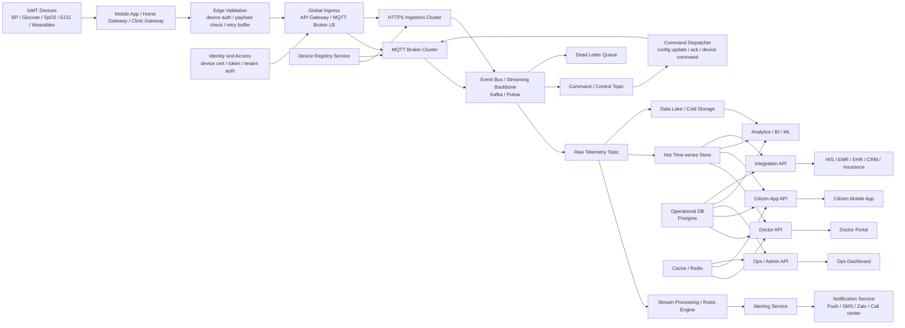
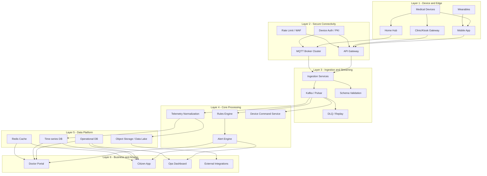
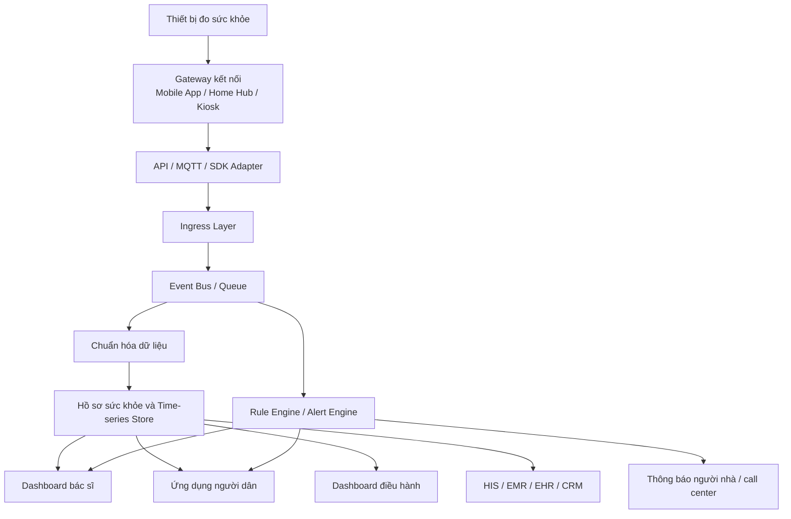
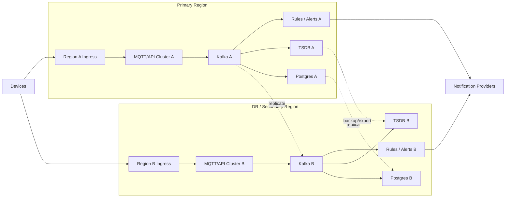

# 03. Kiến trúc IoMT cho hệ thống khám sức khỏe ở quy mô lớn

## 1. Mục tiêu

Tài liệu này mô tả kiến trúc IoMT cho bài toán **khám sức khỏe, theo dõi sức khỏe chủ động và quản lý bệnh mạn tính** theo hướng **production-first**.

Tức là không tách riêng một bản “nhỏ để pilot” và một bản “lớn để production”, mà thiết kế ngay từ đầu theo logic đủ tốt để mở rộng lên **hàng triệu người dùng và hàng triệu thiết bị**.

Mục tiêu của kiến trúc:

- kết nối số lượng lớn thiết bị y tế,
- hấp thụ lưu lượng dữ liệu liên tục và theo đợt burst,
- phát hiện bất thường gần real-time,
- phục vụ đồng thời bác sĩ, người dân, điều hành và hệ thống tích hợp,
- đảm bảo khả năng mở rộng, độ sẵn sàng cao và khả năng vận hành dài hạn.

---

## 2. Bài toán cần giải

Nếu hệ thống chỉ được vẽ theo kiểu:

**thiết bị -> app -> backend -> dashboard**

thì đủ để minh họa ý tưởng, nhưng không đủ để trả lời các câu hỏi production như:

- nếu có hàng triệu thiết bị cùng gửi dữ liệu thì ingestion chịu thế nào,
- nếu reconnect hàng loạt thì chống nghẽn ra sao,
- nếu alert engine chậm thì có ảnh hưởng toàn hệ thống không,
- nếu cần tích hợp HIS/EMR thì dữ liệu đi qua đâu,
- nếu một vùng hạ tầng lỗi thì dịch vụ có tiếp tục chạy không.

Vì vậy kiến trúc đúng phải được xây theo tư duy:

- **event-driven**,
- **queue-first**,
- **async processing**,
- **storage phân tầng**,
- **HA/DR ngay trong thiết kế**.

---

## 3. Giả định tải cơ bản

Một ví dụ quy mô tham chiếu:

- **1.000.000 thiết bị**
- mỗi thiết bị gửi dữ liệu trung bình **5 phút/lần**
- tương đương khoảng:
  - **200.000 events/phút**
  - **~3.300 events/giây**

Trong thực tế, tải còn tăng mạnh ở các tình huống:

- reconnect hàng loạt sau mất mạng,
- đồng bộ bù sau khi offline,
- chiến dịch khám tập trung tại doanh nghiệp hoặc cộng đồng,
- nhiều loại thiết bị cùng đẩy dữ liệu theo đợt.

Cho nên kiến trúc phải chịu được không chỉ **average load**, mà còn cả **burst load**.

---

## 4. Kiến trúc tổng thể production-scale

---

## 5. Giải thích kiến trúc theo lớp

### 5.1. Lớp Device và Edge

Bao gồm:

- thiết bị đo huyết áp,
- đường huyết,
- SpO2,
- ECG,
- wearable,
- mobile app,
- home gateway,
- clinic/kiosk gateway.

Lớp này có trách nhiệm:

- thu thập dữ liệu gốc,
- validate sơ bộ,
- buffer tạm khi mất mạng,
- retry an toàn,
- giảm phụ thuộc vào hành vi người dùng cuối.

### 5.2. Lớp Global Ingress

Đây là lớp đầu vào của toàn hệ thống.

Bao gồm:

- API Gateway,
- MQTT Broker Cluster,
- HTTPS Ingestion Cluster,
- Load Balancer,
- Device Auth / PKI / tenant token.

Đây là lớp phải scale ngang rất mạnh vì nó hứng toàn bộ kết nối và traffic từ ngoài vào.

### 5.3. Lớp Event Bus / Streaming Backbone

Đây là phần bắt buộc nếu muốn đi xa hơn quy mô demo.

Vai trò chính:

- hấp thụ burst traffic,
- tách ingestion khỏi business processing,
- cho phép nhiều downstream consumer chạy độc lập,
- replay dữ liệu khi cần,
- không để một service chậm làm nghẽn toàn hệ thống.

### 5.4. Lớp Processing và Alerting

Sau khi dữ liệu vào event backbone, hệ thống cần:

- chuẩn hóa measurement,
- ánh xạ device với patient,
- kiểm tra ngưỡng,
- phân tích xu hướng,
- sinh cảnh báo,
- gửi thông báo,
- đẩy command/config ngược về thiết bị nếu cần.

Điểm quan trọng là **rules engine và alerting service phải đứng riêng**, không nhét vào API đọc/ghi thông thường.

### 5.5. Lớp Data Platform

Dữ liệu phải được phân tầng theo mục đích sử dụng:

- **Operational DB**: user, patient, tenant, device registry, workflow, config
- **Hot Time-series Store**: dữ liệu đo gần đây, query nhanh cho dashboard và bác sĩ
- **Redis Cache**: trạng thái nóng, idempotency, rate limit, latest readings
- **Cold Storage / Data Lake**: dữ liệu dài hạn cho analytics, BI, ML, audit

### 5.6. Lớp API và Kênh sử dụng

Hệ thống phải phục vụ nhiều nhóm người dùng khác nhau:

- bác sĩ,
- người dân,
- điều hành,
- hệ thống tích hợp ngoài.

Do đó read path phải được thiết kế riêng để:

- không ảnh hưởng write path,
- không làm nghẽn ingestion,
- hỗ trợ query tối ưu cho từng loại người dùng.

---

## 6. Sơ đồ phân lớp kỹ thuật

---

## 7. Luồng dữ liệu và cảnh báo

### 7.1. Ý nghĩa luồng

1. Thiết bị sinh measurement
2. Gateway nhận và đẩy dữ liệu lên ingress
3. Ingress chỉ nhận, xác thực, và chuyển vào event bus
4. Processing service đọc từ event bus để chuẩn hóa dữ liệu
5. Rule engine đọc cùng nguồn dữ liệu để kiểm tra ngưỡng và xu hướng
6. Dữ liệu được lưu vào store tối ưu cho truy vấn nghiệp vụ
7. Cảnh báo được gửi tới đúng vai trò sử dụng

---

## 8. Nguyên tắc thiết kế bắt buộc

### 8.1. Queue-first

Không để thiết bị ghi thẳng vào business DB hoặc app monolith.

Luồng đúng phải là:

**device -> ingress -> broker -> consumers -> storage / rules / alerts**

### 8.2. Tách write path và read path

- write path tối ưu cho ingest lớn,
- read path tối ưu cho dashboard, app và truy vấn bác sĩ.

### 8.3. Storage phân tầng

Không nên nhét toàn bộ measurement vào một bảng quan hệ duy nhất.

Phải tách:

- dữ liệu giao dịch và cấu hình,
- dữ liệu time-series nóng,
- dữ liệu lịch sử dài hạn,
- cache trạng thái gần nhất.

### 8.4. Idempotency và duplicate handling

Thiết bị IoMT rất dễ resend khi mạng yếu hoặc reconnect.

Phải có:

- message id,
- dedupe key,
- retry-safe consumer,
- cơ chế xử lý hiệu quả để tránh ghi lặp và cảnh báo sai.

### 8.5. Backpressure và DLQ

Hệ thống phải chấp nhận việc downstream có lúc chậm hoặc lỗi.

Cho nên cần:

- queue buffer,
- retry policy,
- dead-letter queue,
- lag monitoring,
- circuit breaker.

---

## 9. High Availability và Disaster Recovery

### 9.1. Ý nghĩa

- không phụ thuộc vào một cụm duy nhất,
- có thể failover hoặc DR theo vùng,
- dữ liệu nóng và dữ liệu giao dịch đều có chiến lược sao lưu/nhân bản riêng,
- notification có thể đi từ nhiều region để tránh single point of failure.

---

## 10. Khuyến nghị công nghệ tham khảo

Một stack hợp lý có thể gồm:

- **Ingress / Connectivity**: API Gateway, LB, MQTT broker cluster
- **Streaming backbone**: Kafka hoặc Pulsar
- **Processing**: stream consumers, rules engine, alert service riêng
- **Operational DB**: PostgreSQL
- **Time-series store**: TimescaleDB / ClickHouse / InfluxDB tùy pattern query
- **Cache**: Redis
- **Cold storage**: object storage / data lake
- **Observability**: metrics, logs, traces, alerting

Điểm quan trọng không phải là chọn đúng 1 công nghệ “hot”, mà là chọn stack phù hợp với:

- pattern dữ liệu,
- kiểu query,
- chi phí vận hành,
- năng lực đội triển khai.

---

## 11. Kết luận

Kiến trúc IoMT cho khám sức khỏe ở quy mô lớn không thể dừng ở sơ đồ kết nối mức khái niệm.

Nó phải được thiết kế ngay từ đầu như một **distributed platform cho healthcare telemetry**, với đầy đủ các lớp:

- device và gateway,
- ingress chịu tải lớn,
- event backbone,
- processing và alerting tách riêng,
- storage phân tầng,
- read/write path độc lập,
- HA/DR rõ ràng.

Nói ngắn gọn: nếu mục tiêu là hàng triệu người dùng hoặc hàng triệu thiết bị, thì kiến trúc phải mang tư duy production ngay từ đầu, chứ không phải “làm nhỏ trước rồi sau này vá thêm”.
