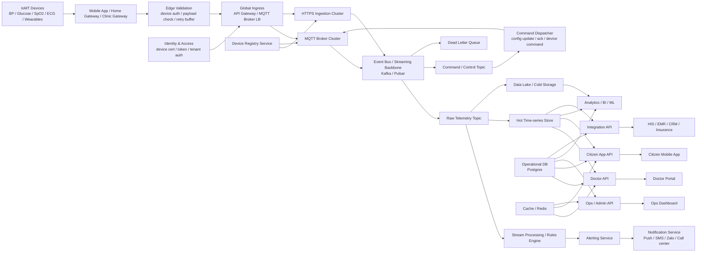
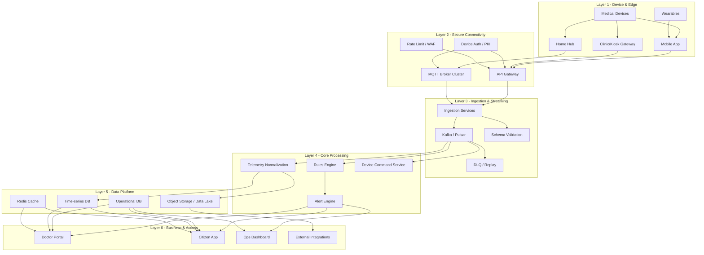
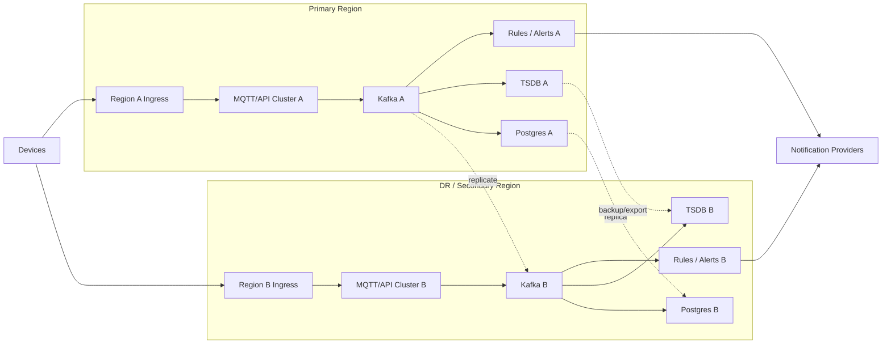

# 04. Production Architecture cho hệ thống khám sức khỏe ở quy mô 1M IoMT Devices

## 1. Mục tiêu

Tài liệu này mô tả kiến trúc production cho nền tảng **IoMT cho khám sức khỏe** trong bối cảnh hệ thống cần phục vụ khoảng **1 triệu thiết bị đo sức khỏe**.

Mục tiêu của kiến trúc:

- Hỗ trợ kết nối số lượng lớn thiết bị IoMT
- Hấp thụ lưu lượng đo theo thời gian thực và theo đợt burst
- Xử lý cảnh báo gần real-time
- Tách biệt ingestion, xử lý nghiệp vụ, lưu trữ và truy vấn
- Đảm bảo khả năng mở rộng, độ sẵn sàng cao và khả năng phục hồi khi có sự cố vùng/hạ tầng

---

## 2. Các giả định tải cơ bản

Ví dụ để ước lượng quy mô:

- **1,000,000 devices**
- Mỗi thiết bị gửi dữ liệu trung bình **mỗi 5 phút/lần**
- Tương đương khoảng:
  - **200,000 events/phút**
  - **~3,300 events/giây**

Trong các đợt cao điểm hoặc khi reconnect hàng loạt, tải có thể tăng mạnh hơn đáng kể. Vì vậy hệ thống phải được thiết kế theo hướng:

- chịu burst,
- queue-first,
- xử lý bất đồng bộ,
- scale ngang theo từng lớp.

---

## 3. Sơ đồ kiến trúc production tổng thể

---

## 4. Sơ đồ phân lớp kỹ thuật

---

## 5. Sơ đồ High Availability / Disaster Recovery

---

## 6. Giải thích các thành phần chính

### 6.1. Device & Edge Layer

Lớp này bao gồm:

- thiết bị đo y tế,
- wearable,
- mobile app,
- home gateway,
- kiosk/clinic gateway.

Mục tiêu là giảm độ phức tạp cho người dùng cuối, đồng thời kiểm soát lỗi thiết bị, validate sơ bộ và hỗ trợ retry khi mất kết nối.

### 6.2. Global Ingress Layer

Lớp ingress chịu trách nhiệm nhận dữ liệu từ thiết bị và gateway ở quy mô lớn.

Thành phần quan trọng:

- **API Gateway**: tiếp nhận traffic HTTPS
- **MQTT Broker Cluster**: phù hợp cho thiết bị cần kết nối nhẹ, liên tục, số lượng lớn
- **Load Balancer**: phân phối tải và hỗ trợ HA
- **Device Auth / PKI / Token**: xác thực thiết bị và tenant

Đây là lớp cần scale ngang mạnh, vì nó trực tiếp hứng tải từ ngoài vào.

### 6.3. Streaming Backbone

Lớp message backbone là phần bắt buộc nếu muốn scale lên 1M devices.

Các thành phần tiêu biểu:

- **Kafka hoặc Pulsar**
- topic telemetry thô
- topic command/control
- DLQ để giữ bản tin lỗi

Mục tiêu:

- hấp thụ burst,
- tách ingestion khỏi business processing,
- replay khi cần,
- tránh làm nghẽn toàn hệ thống nếu một service downstream chậm.

### 6.4. Processing & Rules Layer

Dữ liệu đi vào stream processing để:

- chuẩn hóa measurement,
- ánh xạ patient/device,
- kiểm tra ngưỡng,
- phân tầng nguy cơ,
- tạo cảnh báo,
- sinh lệnh điều khiển ngược nếu cần.

Điểm quan trọng: **rules engine phải là service riêng**, không nên nhét vào API ứng dụng chính.

### 6.5. Data Layer

Kiến trúc dữ liệu phải tách theo tính chất sử dụng:

- **Operational DB (Postgres)**: user, patient, device registry, tenant, config, workflow
- **Hot Time-series Store**: measurement gần đây, query nhanh, dashboard vận hành và bác sĩ
- **Redis Cache**: cache nóng, trạng thái mới nhất, idempotency, rate limiting
- **Data Lake / Cold Storage**: lưu lịch sử dài hạn, analytics, BI, ML

Không nên dồn toàn bộ telemetry vào một bảng Postgres thông thường.

### 6.6. API & Experience Layer

Lớp này phục vụ các nhóm người dùng khác nhau:

- **Doctor API / Portal**
- **Citizen App API / Mobile App**
- **Ops / Admin API / Dashboard**
- **Integration API** cho HIS / EMR / CRM / Insurance

Nguyên tắc là **read path phải tách khỏi write path** để việc bác sĩ xem dữ liệu không ảnh hưởng ingest dữ liệu thiết bị.

---

## 7. Nguyên tắc thiết kế bắt buộc cho 1M devices

### 7.1. Queue-first, async-first

Không để thiết bị ghi thẳng vào app business hoặc DB chính.

Luồng đúng là:

**device -> ingress -> broker -> consumers -> storage / rules / alerts**

### 7.2. Tách write path và read path

- Write path tối ưu cho ingest lớn
- Read path tối ưu cho dashboard, truy vấn bác sĩ, mobile app

### 7.3. Partition theo tenant / region / device type

Nếu scale lớn, cần partition dữ liệu và traffic theo:

- khu vực địa lý,
- loại tenant,
- loại thiết bị,
- patient shard,
- time partition.

### 7.4. Idempotency và duplicate handling

Thiết bị IoMT dễ resend hoặc reconnect nhiều lần.

Vì vậy hệ thống phải có:

- message id,
- dedupe key,
- replay-safe consumers,
- exactly-once không bắt buộc tuyệt đối, nhưng phải **effectively-once** ở tầng nghiệp vụ quan trọng.

### 7.5. Backpressure và DLQ

Phải chấp nhận rằng downstream có lúc chậm hoặc lỗi.

Do đó cần:

- queue buffer,
- retry policy,
- dead-letter queue,
- monitoring lag,
- circuit breaker.

---

## 8. Khuyến nghị công nghệ tham khảo

Một stack hợp lý có thể là:

- **Connectivity / ingress**: Nginx / Envoy / managed LB, MQTT broker cluster
- **Streaming backbone**: Kafka hoặc Pulsar
- **Processing**: stream consumers, rules engine riêng
- **Operational DB**: PostgreSQL
- **Time-series**: TimescaleDB / ClickHouse / InfluxDB tùy pattern query
- **Cache**: Redis
- **Cold storage**: S3-compatible object storage / data lake
- **Analytics**: BI + batch/stream analytics
- **Observability**: Prometheus, Grafana, logs, tracing, alerting

---

## 9. Lộ trình scale hợp lý

### Giai đoạn 1: 10k - 50k devices
- xác nhận data model
- xác nhận quy trình alert
- pilot với mobile app gateway là chính

### Giai đoạn 2: 100k - 300k devices
- đưa message broker vào lõi
- tách rules engine
- đưa time-series store riêng
- làm observability và replay

### Giai đoạn 3: 1M devices
- scale ngang ingress và consumers
- partition theo tenant/region
- active-standby hoặc multi-region DR
- capacity planning và load test định kỳ

---

## 10. Kết luận

Mô hình IoMT cơ bản là đúng về logic, nhưng để vận hành production cho bài toán **khám sức khỏe** ở quy mô **1 triệu thiết bị**, hệ thống bắt buộc phải chuyển sang kiến trúc:

- **event-driven**,
- **ingestion tách riêng**,
- **message backbone trung gian**,
- **storage phân tầng**,
- **rules/alert service độc lập**,
- **HA/DR rõ ràng**.

Nói ngắn gọn: với 1M devices, đây không còn là bài toán app CRUD thông thường nữa, mà là một **distributed platform cho healthcare telemetry**.
