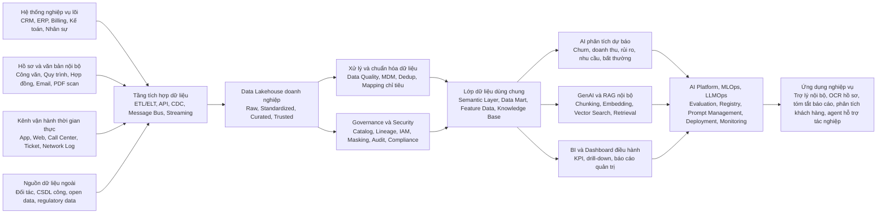

# Kiến trúc dữ liệu và nền tảng AI trong doanh nghiệp

## 1. Mục tiêu

Tài liệu này mô tả một kiến trúc dữ liệu và nền tảng AI ở cấp doanh nghiệp, với mục tiêu phục vụ đồng thời:

- báo cáo và điều hành,
- phân tích dữ liệu,
- machine learning,
- GenAI và RAG,
- các ứng dụng AI tích hợp vào quy trình nghiệp vụ.

Cách tiếp cận ở đây không bắt đầu từ model, mà bắt đầu từ nền tảng dữ liệu, governance và khả năng vận hành production.

---

## 2. Bài toán cần giải

Trong phần lớn doanh nghiệp lớn, dữ liệu thường tồn tại ở nhiều trạng thái rời rạc:

- dữ liệu giao dịch nằm trong các hệ thống nghiệp vụ khác nhau,
- dữ liệu văn bản và hồ sơ nằm trong file server, email, PDF, scan,
- dữ liệu vận hành thời gian thực phát sinh từ app, web, call center, ticket hoặc log hệ thống,
- dữ liệu ngoài doanh nghiệp đến từ đối tác, cơ quan quản lý hoặc nguồn công khai.

Nếu không có một kiến trúc thống nhất, doanh nghiệp thường gặp các vấn đề:

- dữ liệu phân mảnh,
- chất lượng dữ liệu không ổn định,
- khó làm lineage và audit,
- AI chỉ dừng ở mức PoC,
- cùng một dữ liệu nhưng mỗi nơi hiểu một kiểu,
- khó tích hợp BI, ML và GenAI trên cùng một nền tảng.

---

## 3. Nguyên tắc thiết kế

Kiến trúc này dựa trên 4 nguyên tắc chính:

### 3.1. Data-first, không model-first

Model chỉ tạo ra giá trị khi dữ liệu đủ sạch, đủ ngữ cảnh và đủ tin cậy.

### 3.2. Một nền tảng, nhiều kiểu khai thác

Cùng một lớp dữ liệu dùng chung phải phục vụ được:

- dashboard và BI,
- mô hình dự báo,
- AI agent,
- RAG và hỏi đáp tài liệu,
- API dữ liệu cho ứng dụng nghiệp vụ.

### 3.3. Governance đi cùng từ đầu

Không chờ đến lúc gần production mới bổ sung catalog, lineage, IAM, masking hay audit.

### 3.4. Production-oriented

Kiến trúc phải tính ngay đến:

- chất lượng dữ liệu,
- chi phí vận hành,
- monitoring,
- security,
- khả năng mở rộng,
- khả năng tích hợp lâu dài.

---

## 4. Mô hình kiến trúc tổng thể

---

## 5. Giải thích từng lớp kiến trúc

### 5.1. Nguồn dữ liệu

Đây là nơi sinh ra dữ liệu gốc. Trong thực tế thường gồm 4 nhóm lớn:

- **hệ thống nghiệp vụ lõi**: CRM, ERP, billing, kế toán, nhân sự,
- **tài liệu và hồ sơ nội bộ**: hợp đồng, quy trình, công văn, email, PDF,
- **dữ liệu vận hành thời gian thực**: app events, web events, call center, ticket, logs,
- **dữ liệu ngoài**: đối tác, dữ liệu công, dữ liệu quản lý nhà nước.

Đặc điểm của lớp này là dị biệt về định dạng, chất lượng và tốc độ phát sinh dữ liệu.

### 5.2. Tầng tích hợp dữ liệu

Đây là lớp gom dữ liệu từ nhiều nguồn khác nhau về một kiến trúc thống nhất.

Các cơ chế phổ biến gồm:

- ETL/ELT theo batch,
- API sync,
- CDC từ database giao dịch,
- message bus,
- streaming pipeline.

Mục tiêu của lớp này là:

- giảm phụ thuộc point-to-point,
- chuẩn hóa luồng dữ liệu vào,
- tạo nền cho xử lý downstream.

### 5.3. Data Lakehouse

Lakehouse đóng vai trò trung tâm lưu trữ và hợp nhất dữ liệu.

Một cấu trúc hợp lý thường chia thành các vùng:

- **Raw**: dữ liệu gốc mới ingest,
- **Standardized**: dữ liệu đã chuẩn hóa định dạng,
- **Curated**: dữ liệu đã làm sạch và cấu trúc theo domain,
- **Trusted**: dữ liệu được công nhận để dùng cho báo cáo và AI.

Điểm quan trọng là dữ liệu phải đi qua các lớp trưởng thành rõ ràng, thay vì đổ hết vào một kho rồi ai dùng thế nào cũng được.

### 5.4. Xử lý và chuẩn hóa dữ liệu

Lớp này chịu trách nhiệm nâng chất lượng dữ liệu trước khi đưa sang khai thác.

Các chức năng điển hình:

- data quality rules,
- MDM,
- dedup,
- mapping chỉ tiêu,
- chuẩn hóa mã dùng chung,
- chuẩn hóa ngữ nghĩa giữa các hệ thống.

Nếu lớp này yếu, mọi AI phía trên sẽ cho ra kết quả kém ổn định.

### 5.5. Governance và Security

Đây là lớp bắt buộc nếu muốn đi xa hơn mức PoC.

Các năng lực chính:

- data catalog,
- lineage,
- IAM,
- masking dữ liệu nhạy cảm,
- audit log,
- policy và compliance.

Governance không chỉ để “đáp ứng quy định”, mà còn để doanh nghiệp biết:

- dữ liệu này đến từ đâu,
- ai được dùng,
- ai đã sửa,
- dashboard hay model nào đang phụ thuộc vào nó.

### 5.6. Lớp dữ liệu dùng chung

Đây là lớp giúp nhiều hệ thống khai thác cùng một nền dữ liệu mà không phải tự xử lý lại từ đầu.

Bao gồm:

- semantic layer,
- data mart,
- feature data,
- knowledge base.

Lớp này rất quan trọng vì nó là điểm giao giữa dữ liệu thô và ứng dụng cuối.

### 5.7. BI, ML và GenAI

Trên cùng một nền tảng dữ liệu dùng chung, doanh nghiệp có thể phát triển song song:

- **BI và dashboard** cho điều hành,
- **ML** cho phân tích dự báo,
- **GenAI và RAG** cho hỏi đáp, tóm tắt, truy xuất tri thức nội bộ.

Nếu kiến trúc tốt, 3 nhánh này không phá nhau mà bổ trợ nhau.

### 5.8. AI Platform / MLOps / LLMOps

Đây là lớp vận hành để AI đi vào production.

Nó cần đảm bảo:

- quản lý model và prompt,
- theo dõi evaluation,
- deployment có kiểm soát,
- monitoring cost, latency, accuracy,
- rollback khi có regression.

Không có lớp này, AI rất dễ bị mắc kẹt ở mức demo đẹp nhưng không ổn định khi vận hành thật.

---

## 6. Các use case doanh nghiệp phù hợp

Một kiến trúc như vậy phù hợp với các nhóm use case sau:

### 6.1. Điều hành và báo cáo

- dashboard KPI,
- drill-down theo đơn vị,
- báo cáo quản trị,
- cảnh báo bất thường theo ngưỡng.

### 6.2. Phân tích dự báo

- churn prediction,
- doanh thu,
- rủi ro,
- dự báo nhu cầu,
- phát hiện bất thường.

### 6.3. GenAI nội bộ

- hỏi đáp tài liệu,
- tóm tắt văn bản,
- hỗ trợ tra cứu quy trình,
- trợ lý nội bộ cho vận hành.

### 6.4. Tự động hóa nghiệp vụ bằng AI

- OCR hồ sơ,
- agent hỗ trợ tác nghiệp,
- phân loại ticket,
- gợi ý xử lý,
- tổng hợp báo cáo tự động.

---

## 7. Điều kiện để đi được đến production

Muốn hệ thống đi được từ ý tưởng sang vận hành thực tế, phải có đủ các điều kiện sau:

- dữ liệu có owner rõ,
- dữ liệu có mức chất lượng đo được,
- có lineage và audit,
- có security và phân quyền,
- có monitoring chi phí và hiệu năng,
- có quy trình release cho model/prompt,
- có cơ chế đánh giá chất lượng trước và sau khi triển khai.

Nói cách khác: AI production không phải chỉ là “chọn model nào”, mà là bài toán kết hợp giữa dữ liệu, platform và vận hành.

---

## 8. Kết luận

Giá trị cốt lõi của kiến trúc này nằm ở chỗ nó biến AI từ một tập hợp use case rời rạc thành một nền tảng có thể mở rộng và tái sử dụng.

Nếu làm đúng, doanh nghiệp sẽ có:

- một nguồn dữ liệu đáng tin cậy hơn,
- một lớp governance đủ chặt,
- một nền tảng đủ linh hoạt để phục vụ BI, ML và GenAI cùng lúc,
- và một con đường rõ ràng từ PoC đến production.

Đó mới là điều quyết định AI có tạo ra giá trị thật hay không.