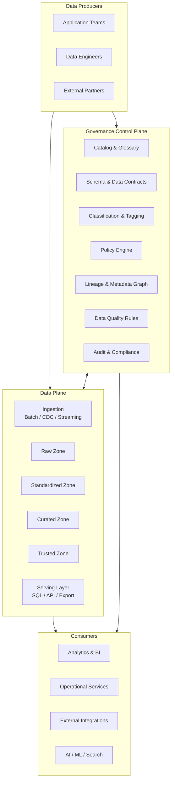
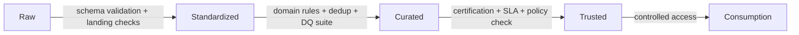
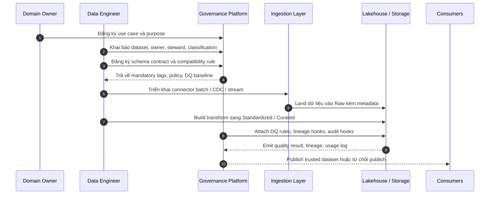
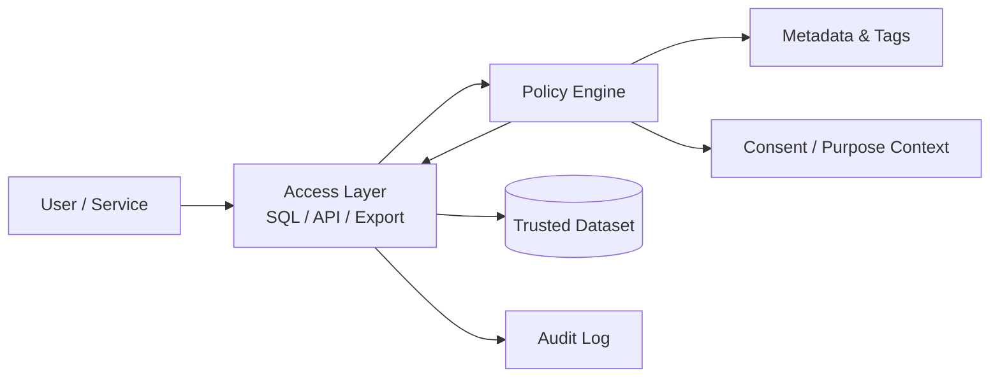
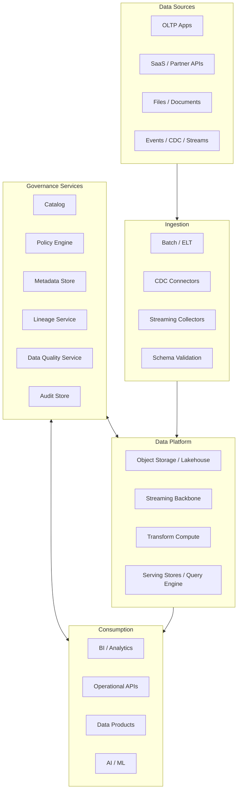
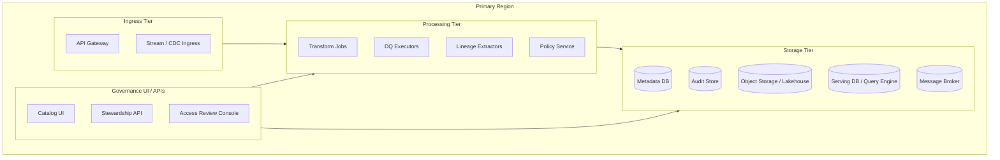
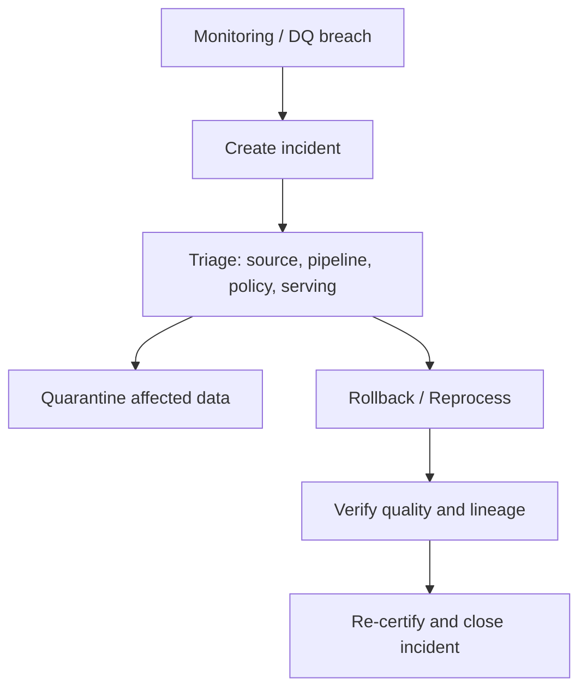

# Tổng quan Data Governance cho hệ thống phần mềm lớn

## Executive Summary

Tài liệu này mô tả một mô hình **data governance end-to-end** dành cho hệ thống phần mềm quy mô lớn, nơi dữ liệu đi qua nhiều nguồn, nhiều pipeline, nhiều nhóm kỹ thuật và nhiều lớp tiêu thụ khác nhau như giao dịch, phân tích, báo cáo, API và AI.

Mục tiêu của data governance không phải là thêm thủ tục hành chính. Mục tiêu là tạo ra một **control plane thống nhất** để mọi dữ liệu quan trọng đều có:

- định nghĩa rõ ràng,
- owner và steward rõ ràng,
- phân loại bảo mật rõ ràng,
- chính sách truy cập rõ ràng,
- chất lượng được đo được,
- lineage truy vết được,
- audit kiểm tra được,
- và cơ chế vận hành đủ thực dụng để triển khai thật.

README này là tài liệu độc lập, trình bày đầy đủ mô hình, sơ đồ triển khai, use case, trade-off và định hướng áp dụng để có thể dùng trực tiếp làm nền cho triển khai.

---

## 1. Khi nào cần data governance ở mức platform

Data governance trở thành bắt buộc khi hệ thống có một hoặc nhiều dấu hiệu sau:

- dữ liệu đến từ nhiều nguồn như OLTP, file, CDC, event stream, SaaS, đối tác;
- nhiều đội cùng tạo, biến đổi và tiêu thụ dữ liệu;
- dữ liệu có chứa PII, tài chính, y tế hoặc dữ liệu nhạy cảm khác;
- cần self-service analytics nhưng vẫn phải kiểm soát quyền;
- cần chứng minh compliance, audit hoặc forensic;
- cần AI/BI chạy trên dữ liệu đáng tin, không dùng dữ liệu “ngầm hiểu”.

Nếu chưa có governance, các vấn đề thường xuất hiện là:

- cùng một business term nhưng nhiều định nghĩa;
- cùng một bảng nhưng không rõ owner;
- pipeline chạy xong nhưng không biết dữ liệu có đạt chất lượng hay không;
- quyền truy cập cấp theo ticket thủ công, khó thu hồi;
- sự cố dữ liệu xảy ra nhưng không truy được upstream/downstream;
- đội AI, BI, product và compliance nói chuyện bằng các “sự thật” khác nhau.

---

## 2. Mục tiêu kiến trúc

Một nền data governance hoàn chỉnh trong hệ thống lớn nên đạt được các mục tiêu sau:

1. **Một sự thật thống nhất về metadata**
   - dataset nào tồn tại,
   - ai sở hữu,
   - mức độ nhạy cảm là gì,
   - SLA/SLO là gì,
   - downstream nào đang phụ thuộc.

2. **Một cơ chế kiểm soát xuyên suốt vòng đời dữ liệu**
   - từ onboard nguồn,
   - ingest,
   - transform,
   - publish,
   - access,
   - retention,
   - archive,
   - đến delete.

3. **Chính sách truy cập thực thi được**
   - không chỉ viết policy trên giấy,
   - mà policy phải đi vào query path, API path, export path và pipeline path.

4. **Data quality có thể đo, cảnh báo và chặn**
   - rule nào đang chạy,
   - ngưỡng là gì,
   - ai chịu trách nhiệm,
   - vi phạm thì block hay cảnh báo.

5. **Lineage và audit đủ sâu để điều tra sự cố**
   - biết dữ liệu đến từ đâu,
   - đã qua job nào,
   - bị ảnh hưởng bởi release nào,
   - ai đã đọc hoặc xuất dữ liệu.

---

## 3. Nguyên tắc thiết kế

1. **Governance là control plane, không phải slide deck**
2. **Metadata trước, automation sau, nhưng phải đến automation**
3. **Chính sách phải thực thi tại runtime, không chỉ review thủ công**
4. **Dữ liệu phải có maturity levels rõ ràng**
5. **Lineage, quality, audit là khả năng nền, không phải tính năng phụ**
6. **Thiết kế theo risk-based governance, không over-govern mọi thứ**
7. **Triển khai theo domain ownership, không dồn mọi quyết định vào một team trung tâm**

---

## 4. Mô hình vận hành tổng thể

### 4.1. Governance operating model

### 4.2. Ý nghĩa mô hình

- **Data plane** chịu trách nhiệm vận chuyển, lưu trữ, biến đổi và phục vụ dữ liệu.
- **Control plane** chịu trách nhiệm định nghĩa luật chơi: metadata, classification, policy, quality, lineage, audit.
- Hai lớp này phải kết nối chặt với nhau để mọi pipeline và mọi query đều chịu governance bằng metadata và policy thống nhất.

---

## 5. Mô hình tổ chức và trách nhiệm

### 5.1. Vai trò cốt lõi

| Vai trò | Trách nhiệm chính |
|---|---|
| Data Owner | Chịu trách nhiệm cuối cùng về dữ liệu trong domain |
| Data Steward | Quản trị nghĩa dữ liệu, glossary, classification, policy metadata |
| Data Engineer | Xây ingestion, transform, DQ checks, lineage hooks |
| Platform Team | Vận hành control plane, policy engine, catalog, audit, observability |
| Security / Compliance | Định nghĩa chuẩn phân loại, retention, masking, access control |
| Data Consumer | Sử dụng dữ liệu đúng purpose, đúng quyền, đúng hợp đồng |

### 5.2. RACI khuyến nghị

| Hạng mục | Responsible | Accountable | Consulted | Informed |
|---|---|---|---|---|
| Business glossary | Data Steward | Data Owner | SMEs | Consumers |
| Dataset contract | Data Engineer | Data Owner | Platform | Consumers |
| Access policy | Security / Platform | Data Owner | Compliance | Consumers |
| Classification | Data Steward | Data Owner | Security | Platform |
| DQ suite | Data Engineer | Data Owner | Analysts | Consumers |
| Incident dữ liệu | Platform / Data Engineer | Data Owner | Security / Ops | Stakeholders |

---

## 6. Metadata model tối thiểu phải có

Một hệ governance chỉ chạy tốt khi metadata đủ tối thiểu ngay từ đầu.

### 6.1. Thực thể metadata cốt lõi

- **Data Asset**: table, topic, file set, object, API dataset, feature set
- **Domain**: vùng nghiệp vụ sở hữu dữ liệu
- **Owner / Steward**: người chịu trách nhiệm và người vận hành metadata
- **Schema / Contract**: cấu trúc dữ liệu, ràng buộc, compatibility strategy
- **Classification**: public, internal, confidential, restricted
- **Sensitive Tags**: email, phone, national_id, health, finance, location...
- **Purpose Constraints**: billing, support, analytics, fraud, research...
- **SLA / SLO**: freshness, completeness, availability, accuracy với đơn vị đo và ngưỡng rõ ràng
- **Lineage**: upstream, downstream, job_run_id, version, timestamp
- **Retention Policy**: giữ bao lâu, archive khi nào, xóa khi nào
- **Access Policy**: ai được truy cập, trong điều kiện nào, với obligations nào

### 6.2. Mẫu metadata record

| Thuộc tính | Ví dụ |
|---|---|
| asset_name | `customer_360` |
| asset_type | trusted table |
| domain | customer-platform |
| owner | head_of_customer_data |
| steward | customer-data-steward |
| classification | confidential |
| sensitive_tags | email, phone, address |
| contract_version | v3 |
| freshness_slo | 30 phút |
| freshness_reference | 30 phút tính từ thời điểm source phát sinh event đến lúc dataset trusted sẵn sàng để đọc |
| completeness_slo | >= 99.5% số bản ghi kỳ vọng mỗi ngày |
| availability_slo | 99.9% cho query path của trusted dataset |
| retention | 5 năm |
| access_policy | analyst-read-with-masking |
| lineage_status | dataset-level |
| quality_status | certified |

---

## 7. Data lifecycle và governance gates

### 7.1. Maturity model theo zone

### 7.2. Ý nghĩa từng zone

| Zone | Vai trò | Governance tối thiểu |
|---|---|---|
| Raw | lưu dữ liệu gốc, phục vụ forensic và replay | restricted access, immutable, landing metadata |
| Standardized | chuẩn hóa schema, kiểu dữ liệu, khóa | contract validation, basic DQ, owner rõ ràng |
| Curated | áp business logic và domain model | lineage, DQ nâng cao, semantic definitions |
| Trusted | dữ liệu chính thức để tiêu thụ rộng | SLA, certified status, policy enforcement, audit đầy đủ |

### 7.3. Governance gates

Một dataset chỉ nên đi lên zone cao hơn khi đạt đồng thời:

- schema hợp lệ;
- required tags đã đủ;
- owner/steward đã khai báo;
- DQ suite đạt ngưỡng;
- lineage hook hoạt động;
- policy truy cập đã gắn;
- retention và masking policy đã định nghĩa nếu dữ liệu nhạy cảm.

---

## 8. Luồng triển khai và vận hành

### 8.1. Onboard một nguồn dữ liệu mới

### 8.2. Access dữ liệu qua query hoặc API

Policy engine nên trả về không chỉ **allow / deny** mà còn có thể trả về **obligations** như:

- masking cột nhạy cảm,
- row-level filter theo tenant hoặc region,
- limit export,
- bắt buộc justification,
- time-bound access.

---

## 9. Kiến trúc triển khai tham chiếu

### 9.1. Sơ đồ triển khai logic

### 9.2. Sơ đồ triển khai hạ tầng điển hình

### 9.3. Thành phần tối thiểu để chạy production

| Nhóm | Thành phần tối thiểu |
|---|---|
| Metadata | catalog, metadata DB, glossary, ownership registry |
| Policy | IAM integration, policy engine, masking / row filter support |
| Quality | rule registry, execution engine, scorecard, incident hooks |
| Lineage | job metadata capture, dataset lineage graph, version tracking |
| Audit | access log, policy decision log, export log, admin action log |
| Data platform | ingestion, lakehouse or warehouse, transform engine, serving layer |

---

## 10. Use case chính mà mô hình này giải quyết

### 10.1. Self-service analytics có kiểm soát

- Business có thể tự truy cập trusted datasets.
- Quyền truy cập được kiểm soát theo role, tenant, purpose.
- Cột nhạy cảm bị mask tự động nếu người dùng không đủ clearance.

### 10.2. Chứng nhận dữ liệu dùng cho báo cáo quản trị

- Chỉ dataset đạt đủ quality gate mới được gắn nhãn certified.
- Dashboard và báo cáo chỉ đọc từ trusted zone.
- Khi có incident, lineage chỉ ra báo cáo nào bị ảnh hưởng.

### 10.3. Data sharing nội bộ và với đối tác

- Chia sẻ theo data product thay vì dump raw tables.
- Áp dụng contract, retention và export logging.
- Có thể dùng entitlement theo tenant hoặc theo hợp đồng.

### 10.4. Kiểm soát PII / dữ liệu nhạy cảm

- Tự động phân loại trường dữ liệu nhạy cảm.
- Buộc masking hoặc tokenization khi dữ liệu đi ra ngoài boundary.
- Ghi audit cho mọi truy cập và export.

### 10.5. Điều tra sự cố dữ liệu

- Khi phát hiện sai số, có thể lần theo lineage để tìm upstream job hoặc source gây lỗi.
- Có quarantine, rollback, replay và postmortem.

### 10.6. Hỗ trợ AI / ML / Search trên dữ liệu govern

- Chỉ dữ liệu đã classify, có policy và quality rõ ràng mới được publish sang AI/ML workloads.
- Dễ xác định dữ liệu nào được phép dùng cho training, retrieval hoặc feature serving.

---

## 11. Data quality và observability

### 11.1. Phân loại DQ rules

| Nhóm | Ví dụ |
|---|---|
| Validity | type, regex, range |
| Completeness | null rate, missing partitions |
| Uniqueness | duplicate key, dedup drift |
| Consistency | cross-table reconciliation |
| Timeliness | freshness, arrival lag |
| Accuracy | so khớp với source chuẩn |
| Volume | anomaly về số bản ghi |

### 11.2. Mô hình phản ứng sự cố dữ liệu

### 11.3. Chỉ số nên đo thường xuyên

- số dataset đã có owner/steward;
- tỷ lệ dataset có classification đầy đủ;
- tỷ lệ trusted datasets có SLA và DQ suite;
- số policy violations;
- số access request pending quá hạn;
- số incident chất lượng theo domain;
- độ phủ lineage upstream/downstream;
- số export chứa dữ liệu nhạy cảm.

---

## 12. Security, privacy và compliance

### 12.1. Mức phân loại gợi ý

| Level | Ý nghĩa | Kiểm soát đi kèm |
|---|---|---|
| Public | có thể chia sẻ công khai | basic integrity |
| Internal | nội bộ, không quá nhạy cảm | authenticated access |
| Confidential | nhạy cảm | need-to-know, audit, masking |
| Restricted | rất nhạy cảm | approval, strong isolation, export control |

### 12.2. Policy patterns nên hỗ trợ

- **RBAC** theo role nghiệp vụ;
- **ABAC** theo tenant, region, environment, clearance;
- **Purpose-based access** theo mục đích sử dụng;
- **Time-bound access** theo ticket hoặc approval window;
- **Row-level security** cho multi-tenant hoặc phân vùng pháp lý;
- **Column masking** cho PII/PHI/tài chính;
- **Export guardrails** cho dữ liệu khối lượng lớn hoặc dữ liệu restricted.

### 12.3. Audit bắt buộc

- ai truy cập dataset nào;
- vào thời điểm nào;
- bằng cơ chế nào;
- policy nào đã được áp dụng;
- có masking / filtering hay không;
- có export / download hay không;
- thay đổi nào đã được thực hiện trên policy, tags, contracts.

---

## 13. Trade-offs kiến trúc quan trọng

### 13.1. Governance tập trung vs domain federated

| Lựa chọn | Ưu điểm | Nhược điểm |
|---|---|---|
| Tập trung mạnh | chuẩn hóa nhanh, kiểm soát chặt | bottleneck, xa nghiệp vụ |
| Federated theo domain | domain ownership rõ, scale tổ chức tốt | khó đồng nhất nếu platform yếu |

**Khuyến nghị**: platform tập trung cho control plane, ownership phân tán cho từng domain.

### 13.2. Block publish vs cảnh báo mềm khi DQ fail

| Lựa chọn | Ưu điểm | Nhược điểm |
|---|---|---|
| Hard gate | bảo vệ downstream tốt | có thể chặn nghiệp vụ |
| Soft gate | linh hoạt, giảm gián đoạn | downstream dễ dùng dữ liệu lỗi |

**Khuyến nghị**: trusted zone dùng hard gate; curated zone có thể soft gate theo rủi ro.

### 13.3. Dataset-level lineage vs column-level lineage

| Lựa chọn | Ưu điểm | Nhược điểm |
|---|---|---|
| Dataset-level | triển khai nhanh, đủ cho nhiều use case | chưa đủ cho PII tracing sâu |
| Column-level | phân tích tác động rất tốt | tốn công, khó bền nếu parser kém |

**Khuyến nghị**: bắt đầu dataset-level, mở rộng column-level cho vùng dữ liệu nhạy cảm.

### 13.4. Exactly-once vs at-least-once + idempotency

| Lựa chọn | Ưu điểm | Nhược điểm |
|---|---|---|
| Exactly-once | đạt được với nền tảng phù hợp và kiểm soát giao dịch chặt | chi phí hiệu năng và vận hành cao hơn |
| At-least-once + idempotent | thực dụng, hiệu năng tốt | cần kỷ luật dedup và idempotency |

**Khuyến nghị**: đa số hệ lớn nên chọn at-least-once + idempotent processing.

### 13.5. Một kho dữ liệu duy nhất vs polyglot storage

| Lựa chọn | Ưu điểm | Nhược điểm |
|---|---|---|
| Một hệ lưu trữ | đơn giản hơn | khó tối ưu cho nhiều workload |
| Polyglot storage | tối ưu theo access pattern | tăng độ phức tạp vận hành |

**Khuyến nghị**: governance phải độc lập với engine lưu trữ để hỗ trợ nhiều loại storage.

---

## 14. Lộ trình triển khai thực dụng

### Giai đoạn 1: Foundation

- chuẩn hóa classification model;
- thiết lập catalog, ownership và glossary;
- định nghĩa metadata schema tối thiểu;
- chọn trusted datasets đầu tiên;
- tích hợp audit cho access path.

### Giai đoạn 2: Enforcement

- đưa policy engine vào query/API path;
- đưa DQ suite vào pipeline promotion;
- bắt đầu lineage dataset-level;
- đưa access request vào workflow có SLA.

### Giai đoạn 3: Scale

- mở rộng domain onboarding theo template;
- scorecard theo domain;
- self-service catalog và access review;
- retention, purge, export control tự động hóa.

### Giai đoạn 4: Advanced governance

- column-level lineage cho dữ liệu nhạy cảm;
- policy-as-code;
- data product contracts;
- governance cho AI/ML workloads;
- compliance reporting tự động.

---

## 15. Checklist sẵn sàng triển khai

- [ ] Có mô hình classification và sensitive tags thống nhất
- [ ] Mọi dataset quan trọng có owner và steward
- [ ] Có metadata schema tối thiểu áp dụng toàn platform
- [ ] Có contract registration cho nguồn dữ liệu mới
- [ ] Có quality gate trước khi publish trusted dataset
- [ ] Có lineage tối thiểu cho ingest và transform chính
- [ ] Có policy engine tích hợp vào access path
- [ ] Có audit log cho read, export và admin actions
- [ ] Có quy trình incident dữ liệu và quarantine
- [ ] Có retention, archive và delete policy theo loại dữ liệu
- [ ] Có scorecard đo độ phủ governance theo domain

---

## 16. Kết luận

Data governance trong hệ thống phần mềm lớn nên được thiết kế như một **năng lực nền của platform**, không phải một bộ tài liệu riêng lẻ. Giá trị thật của governance nằm ở chỗ nó biến metadata, policy, quality, lineage và audit thành các cơ chế thực thi được trong pipeline và trong runtime.

Nếu triển khai đúng, tổ chức sẽ đạt được:

- dữ liệu đáng tin hơn cho vận hành và ra quyết định,
- thời gian điều tra sự cố ngắn hơn,
- self-service nhanh hơn nhưng vẫn có kiểm soát,
- compliance tốt hơn,
- và nền tảng đủ sạch để mở rộng sang BI, AI, data products và tích hợp quy mô lớn.
