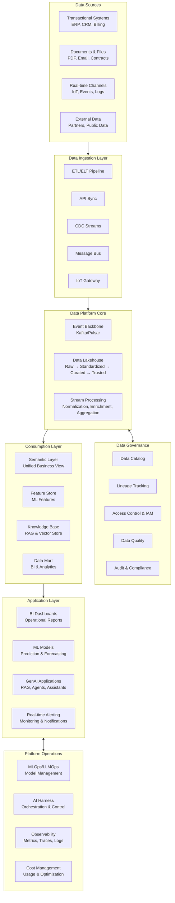
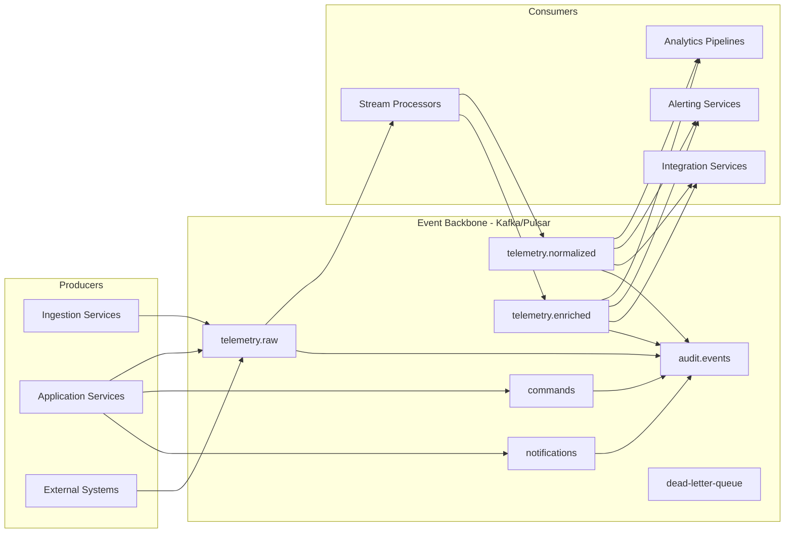
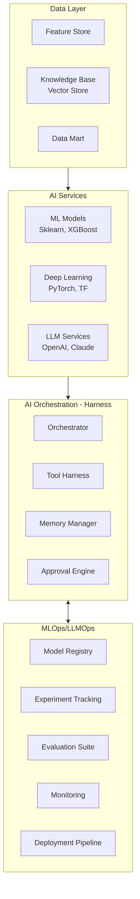
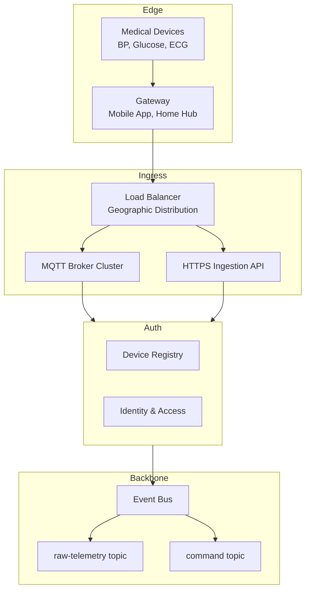
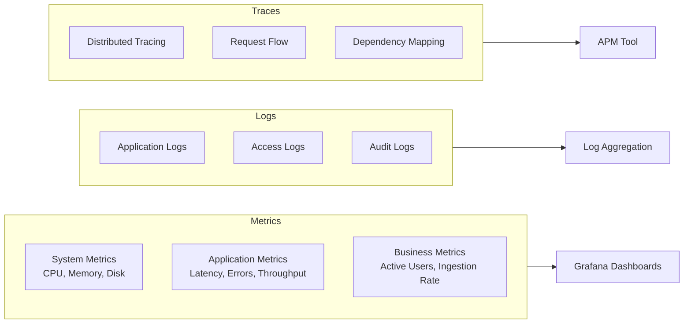

# Data Governance & AI Platform Architecture

## Executive Summary

Repository này chứa các tài liệu kiến trúc kỹ thuật cấp enterprise cho việc xây dựng nền tảng dữ liệu, AI và IoT quy mô lớn. Các tài liệu được viết từ góc nhìn của một kiến trúc sư phần mềm, tập trung vào các quyết định kiến trúc then chốt, trade-offs kỹ thuật và khả năng vận hành production.

**Đối tượng mục tiêu**: Software Architects, Platform Engineers, Technical Leads, Engineering Managers

**Phạm vi**: Enterprise-grade platform architecture cho Data, AI và IoT

---

## 1. Tổng quan kiến trúc

### 1.1. Triết lý thiết kế

Các kiến trúc trong repository này được xây dựng dựa trên các nguyên tắc cốt lõi sau:

1. **Platform thinking, not point solution**
   - Xây dựng nền tảng có khả năng tái sử dụng
   - Phục vụ nhiều use case thay vì giải quyết từng bài toán riêng lẻ

2. **Data-first, not model-first**
   - Chất lượng dữ liệu và governance là nền tảng
   - Model chỉ tạo giá trị khi dữ liệu đủ tin cậy

3. **Separation of concerns**
   - Tách biệt rõ ràng giữa các layer: ingestion, processing, storage, access
   - Read path và write path được thiết kế độc lập

4. **Event-driven architecture**
   - Loose coupling thông qua event backbone
   - Async-by-default để đảm bảo khả năng scale

### 1.2. Kiến trúc tham chiếu tổng thể



---

## 2. Kiến trúc nền tảng (Data + AI)


### 2.1. Mục tiêu kiến trúc

- Một nền tảng **governance-first** để dữ liệu đủ tin cậy cho vận hành, phân tích và AI.
- Một lớp **AI enablement** (RAG/Agents) dùng lại cùng metadata/permissions/audit của data platform.
- Một lớp **operations** (observability + cost + policy) để AI chạy production, không phải demo.

### 2.2. Quyết định then chốt (tóm tắt)

- **Lakehouse nhiều zone** (Raw→Standardized→Curated→Trusted) để trace/replay/quality-gates.
- **Event backbone** (Kafka/Pulsar) để decouple ingestion/processing/consumption và hỗ trợ near-real-time.
- **Governance như control plane**: catalog + lineage + IAM + audit là bắt buộc, không “làm sau”.
- **AI chạy trên nền dữ liệu có kiểm soát**: cùng một policy engine cho SQL/API và cho LLM tools.

## 3. Chi tiết kỹ thuật theo domain

### 3.1. Data Architecture

#### 3.1.1. Data Lakehouse Architecture

Kiến trúc Data Lakehouse là core của data platform, được tổ chức theo các zone maturity:

```
┌─────────────────────────────────────────────────────┐
│  RAW ZONE                                           │
│  - Dữ liệu gốc chưa xử lý                          │
│  - Lưu nguyên định dạng từ source                  │
│  - Immutable, append-only                          │
│  - Retention: forensics & compliance               │
└─────────────────────────────────────────────────────┘
                      ↓
┌─────────────────────────────────────────────────────┐
│  STANDARDIZED ZONE                                  │
│  - Schema chuẩn hóa                                │
│  - Data type normalization                         │
│  - Deduplication                                   │
│  - Basic validation                                │
└─────────────────────────────────────────────────────┘
                      ↓
┌─────────────────────────────────────────────────────┐
│  CURATED ZONE                                       │
│  - Business logic applied                          │
│  - Domain modeling                                 │
│  - Data quality rules enforced                     │
│  - Enrichment & joining                            │
└─────────────────────────────────────────────────────┘
                      ↓
┌─────────────────────────────────────────────────────┐
│  TRUSTED ZONE                                       │
│  - Production-ready data                           │
│  - SLA guarantees                                  │
│  - Certified for reporting & AI                    │
│  - Governance metadata complete                    │
└─────────────────────────────────────────────────────┘
```

**Quyết định kiến trúc quan trọng**:

1. **Tại sao cần multi-zone thay vì một data lake đơn giản?**
   - **Traceability**: có thể trace ngược về raw data
   - **Replay**: có thể reprocess khi logic thay đổi
   - **Quality gates**: data phải qua validation rõ ràng
   - **Access control**: phân quyền theo mức độ tin cậy

2. **Tại sao không dùng traditional data warehouse?**
   - **Flexibility**: hỗ trợ cả structured và unstructured data
   - **Cost**: storage tối ưu hơn cho historical data
   - **ML workloads**: direct access cho training data
   - **Schema evolution**: không bị lock bởi rigid schema

#### 3.1.2. Storage Pattern Strategy

| Data Type | Primary Store | Hot Tier | Cold Tier | Rationale |
|-----------|--------------|----------|-----------|-----------|
| **Transactional data** | PostgreSQL | SSD | - | ACID, relationships, complex queries |
| **Time-series telemetry** | TimescaleDB/ClickHouse | Last 30-90 days | Object storage | High write throughput, time-based queries |
| **Session/cache** | Redis | In-memory | - | Low latency access, TTL support |
| **Unstructured documents** | Object storage | Frequently accessed | Archive tier | Cost-effective, scalable |
| **Vector embeddings** | Specialized vector DB | Active indexes | - | Similarity search performance |
| **Event streams** | Kafka/Pulsar | Configurable retention | S3 tiering | Replay capability, audit trail |

**Nguyên tắc lựa chọn storage**:

1. **Access pattern trumps data size**
   - Random access → indexed store (PostgreSQL, ElasticSearch)
   - Sequential scan → columnar store (Parquet on object storage)
   - Point lookup → key-value store (Redis)

2. **Write vs Read optimization**
   - Write-heavy → log-structured storage (time-series DB, object storage)
   - Read-heavy → indexed, cached access

3. **Data lifecycle management**
   - Hot: recent data, low latency access
   - Warm: queryable but slower
   - Cold: archive, compliance retention

### 3.2. Event-Driven Architecture

#### 3.2.1. Event Backbone Design



**Topic Strategy**:

1. **Naming convention**: `<domain>.<entity>.<event-type>`
   - Ví dụ: `healthcare.vitals.measured`, `iot.device.connected`

2. **Partitioning strategy**:
   ```
   For telemetry: partition by (tenant_id, device_id)
   For commands:  partition by device_id
   For events:    partition by (tenant_id, entity_id)
   ```
   - **Goal**: Balance ordering requirements vs parallelism
   - **Avoid**: Hot partitions từ large tenants

3. **Retention policy**:
   - Raw events: 7-30 days (for replay)
   - Normalized events: 3-7 days (processing buffer)
   - Audit events: long-term (compliance)

#### 3.2.2. Delivery Semantics

**At-least-once + Idempotent Processing**

Lý do chọn at-least-once thay vì exactly-once:

| Aspect | At-least-once | Exactly-once |
|--------|---------------|--------------|
| **Complexity** | Lower | Higher |
| **Performance** | Better throughput | Overhead from coordination |
| **Operational** | Easier to debug | Complex failure scenarios |
| **Cost** | Lower | Higher (more coordination) |

**Implementation pattern**:
```python
# Idempotency key pattern
def process_event(event):
    idempotency_key = f"{event.source}:{event.id}:{event.timestamp}"

    if already_processed(idempotency_key):
        return  # Skip duplicate

    # Process event (side effects must be idempotent)
    result = do_processing(event)

    # Mark as processed
    mark_processed(idempotency_key, result)
```

### 3.3. AI & ML Platform Architecture


#### 3.3.0. AI Integration (RAG + Agents) — điểm ăn tiền

Nếu chỉ “data platform” thì câu chuyện dừng ở ETL/BI. Giá trị mới nằm ở việc biến dữ liệu đã govern thành **knowledge + actions**:

- **RAG/Knowledge Base**: ingest tài liệu, hợp đồng, hướng dẫn, ticket, SOP → chunking → embedding → vector index.
- **Agents/Tools**: LLM không được query trực tiếp mọi thứ; bắt buộc đi qua tool layer (SQL runner, search, ticketing, workflow) có **schema + timeout + approval**.
- **Policy & audit end-to-end**: cùng một `principal`/`tenant`/`purpose` áp vào cả data access và tool execution; mọi prompt/tool call đều log để truy vết.

Mẫu triển khai tối thiểu (production):

1. **Retrieval boundary**: KB chỉ publish dữ liệu đã được classify (PII/PHI), redact và có ACL.
2. **Tool boundary**: tool list theo role; tool có risk level; action nguy hiểm phải approval.
3. **Evaluation boundary**: regression tests cho prompts/agents, đo hallucination, latency, cost.


#### 3.3.1. Unified AI Platform Design



#### 3.3.2. Feature Store Architecture

**Mục đích**: Centralized repository cho ML features với consistency giữa training và serving

```
┌──────────────────────────────────────────────────┐
│  Feature Definition & Transformation Logic       │
│  - Feature computation code                      │
│  - Data quality checks                          │
│  - Versioning                                   │
└──────────────────────────────────────────────────┘
                    ↓
┌──────────────────────────────────────────────────┐
│  Offline Store (Training)                        │
│  - Historical features                           │
│  - Point-in-time correct                        │
│  - Batch computation                            │
│  Storage: Data Lake, Data Warehouse             │
└──────────────────────────────────────────────────┘
                    ↓
┌──────────────────────────────────────────────────┐
│  Online Store (Serving)                          │
│  - Low latency access (<10ms)                   │
│  - Latest feature values                        │
│  - Real-time updates                            │
│  Storage: Redis, DynamoDB                       │
└──────────────────────────────────────────────────┘
```

**Key benefits**:
- **Consistency**: Training-serving skew eliminated
- **Reusability**: Features shared across models
- **Governance**: Lineage và ownership tracking

#### 3.3.3. AI Harness - Orchestration Layer

**State Machine cho AI Runs**:

```
pending → classifying → planning → awaiting_approval
                                         ↓
                                    executing
                                         ↓
                              waiting_external ← → executing
                                         ↓
                                  synthesizing
                                         ↓
                                    completed
```

**Core components**:

1. **Session Management**
   ```python
   Session:
     - id: UUID
     - channel: str (web, api, telegram)
     - context: Dict
     - created_at: timestamp
     - last_activity: timestamp
   ```

2. **Run Tracking**
   ```python
   Run:
     - id: UUID
     - session_id: UUID
     - task_type: str
     - strategy: str
     - model: str
     - status: str
     - metrics: {latency, tokens, cost}
   ```

3. **Tool Harness**
   ```python
   Tool:
     - name: str
     - schema: JSONSchema
     - timeout: int
     - retry_policy: RetryConfig
     - requires_approval: bool
     - side_effect_level: Enum
   ```

4. **Approval Workflow**
   ```python
   Approval:
     - run_id: UUID
     - action_type: str
     - risk_level: Enum
     - status: pending | approved | denied
     - approver: Optional[str]
   ```

### 3.4. IoT/IoMT Specific Architecture

#### 3.4.1. Device Connectivity Layer



**Dual Ingress Rationale**:

| Protocol | Use Case | Characteristics |
|----------|----------|-----------------|
| **MQTT** | Long-lived connections, IoT devices | Lightweight, pub/sub, QoS levels |
| **HTTPS** | Mobile apps, batch sync | Request/response, standard tooling |

**Decision**: Support both để maximize device compatibility

#### 3.4.2. Time-Series Data Strategy

**Hot vs Cold Path**:

```
┌────────────────────────────────────────┐
│  Ingestion (Event Backbone)            │
└────────────┬───────────────────────────┘
             │
        ┌────┴─────┐
        ↓          ↓
┌──────────┐  ┌──────────────────┐
│ Hot Path │  │   Cold Path      │
│          │  │                  │
│ TSDB     │  │ Object Storage   │
│ (30-90d) │  │ (Parquet/ORC)    │
│          │  │                  │
│ Dashboard│  │ Analytics        │
│ Alerting │  │ ML Training      │
│ Real-time│  │ Compliance       │
└──────────┘  └──────────────────┘
```

**Partitioning Strategy**:
- By time: daily/hourly partitions
- By tenant: multi-tenancy isolation
- By device type: optimize query patterns

**Retention Policy**:
- Hot: 30-90 days (configurable by tenant)
- Cold: 7+ years (regulatory compliance)

### 3.5. Security Architecture

#### 3.5.1. Defense in Depth

```
┌─────────────────────────────────────────────────┐
│  Layer 1: Network Security                      │
│  - VPC isolation                                │
│  - Security groups                              │
│  - WAF for public endpoints                    │
└─────────────────────────────────────────────────┘
┌─────────────────────────────────────────────────┐
│  Layer 2: Identity & Access                     │
│  - Device certificates (IoT)                    │
│  - OAuth/OIDC (users)                          │
│  - Service-to-service auth                     │
│  - Multi-tenant isolation                      │
└─────────────────────────────────────────────────┘
┌─────────────────────────────────────────────────┐
│  Layer 3: Data Protection                       │
│  - TLS in-transit                              │
│  - Encryption at-rest                          │
│  - Field-level encryption (PII/PHI)            │
│  - Tokenization/pseudonymization               │
└─────────────────────────────────────────────────┘
┌─────────────────────────────────────────────────┐
│  Layer 4: Application Security                  │
│  - Input validation                            │
│  - SQL injection prevention                    │
│  - XSS protection                              │
│  - Rate limiting                               │
└─────────────────────────────────────────────────┘
┌─────────────────────────────────────────────────┐
│  Layer 5: Audit & Compliance                    │
│  - Immutable audit logs                        │
│  - Access logging                              │
│  - Data lineage                                │
│  - Compliance reporting                        │
└─────────────────────────────────────────────────┘
```

#### 3.5.2. Multi-Tenancy Isolation

**Isolation Levels**:

1. **Data isolation**
   ```sql
   -- Row-level security in PostgreSQL
   CREATE POLICY tenant_isolation ON measurements
     USING (tenant_id = current_setting('app.current_tenant')::uuid);
   ```

2. **Compute isolation**
   - Separate consumer groups per tenant (large tenants)
   - Shared consumers with tenant filtering (small tenants)

3. **Network isolation**
   - VPC per environment
   - Subnet isolation for tiers

---

## 4. Non-Functional Requirements

### 4.1. Performance

| Metric | Target | Measurement Method |
|--------|--------|-------------------|
| **API latency (p95)** | <200ms | Application metrics |
| **API latency (p99)** | <500ms | Application metrics |
| **Ingestion throughput** | 10K+ events/sec | Kafka metrics |
| **Query response time** | <3s for dashboard | APM tracing |
| **Batch processing SLA** | <1 hour for daily jobs | Airflow/scheduler |

### 4.2. Availability

| Component | Target SLA | Architecture Pattern |
|-----------|-----------|---------------------|
| **Ingestion path** | 99.9% | Multi-AZ, auto-scaling |
| **API layer** | 99.9% | Load balanced, stateless |
| **Data platform** | 99.5% | HA database, replicas |
| **Batch processing** | 95% | Retry logic, DLQ |

**Downtime budget**:
- 99.9% = ~43 minutes/month
- 99.5% = ~3.6 hours/month

### 4.3. Scalability

**Horizontal scaling targets**:

```
Current → Target (12 months)
─────────────────────────────
Users:        100K → 1M
Devices:      100K → 1M
Events/sec:   1K   → 10K
Data volume:  10TB → 100TB
API RPS:      1K   → 10K
```

**Scaling dimensions**:
1. **Compute**: Kubernetes autoscaling
2. **Storage**: Partitioning, tiering
3. **Network**: CDN, edge caching
4. **Database**: Read replicas, sharding

### 4.4. Disaster Recovery

**RTO/RPO Targets**:

| Data Tier | RPO | RTO | Backup Strategy |
|-----------|-----|-----|----------------|
| **Transactional DB** | <15 min | <1 hour | Continuous replication |
| **Time-series DB** | <1 hour | <4 hours | Periodic snapshots |
| **Data Lake** | <24 hours | <24 hours | Cross-region replication |
| **Config/metadata** | 0 | <30 min | GitOps, IaC |

**DR Strategy**:
- Primary region: Active serving
- Secondary region: Hot standby
- Tertiary: Backup/archive

---

## 5. Observability Strategy

### 5.1. Three Pillars



### 5.2. Golden Signals

**Per service**:
1. **Latency**: How long requests take
2. **Traffic**: How much demand
3. **Errors**: Rate of failed requests
4. **Saturation**: How full is the service

**Telemetry Pipeline-specific**:
1. **Ingestion rate**: Events/second
2. **Consumer lag**: Event backlog
3. **Processing latency**: Time from ingest to materialization
4. **Data quality**: % of valid events

### 5.3. Alerting Strategy

**Alert Levels**:

| Level | Response Time | Examples |
|-------|---------------|----------|
| **P0 - Critical** | Immediate | Data loss, system down |
| **P1 - High** | <15 min | Degraded performance, high error rate |
| **P2 - Medium** | <1 hour | Elevated latency, capacity warnings |
| **P3 - Low** | <24 hours | Anomalies, optimization opportunities |

**Alert fatigue prevention**:
- Use SLO-based alerting
- Group related alerts
- Auto-resolve when conditions clear
- Regular alert review and tuning

---

## 6. Cost Management

### 6.1. Cost Breakdown

**Typical cost distribution** (example for cloud deployment):

```
Compute:           35-40%
  - Application servers
  - Stream processors
  - ML training

Storage:           30-35%
  - Hot storage (DB, cache)
  - Cold storage (object storage)
  - Backup retention

Data Transfer:     10-15%
  - Inter-region
  - Egress to internet

AI/ML Services:    15-20%
  - LLM API calls
  - Model inference
  - Feature computation
```

### 6.2. Cost Optimization Strategies

1. **Storage Tiering**
   - Hot → Warm → Cold based on access patterns
   - Lifecycle policies for automatic transition

2. **Compute Right-Sizing**
   - Auto-scaling based on demand
   - Spot/preemptible instances for batch workloads

3. **Data Transfer Optimization**
   - Regional data locality
   - Compression for large payloads
   - CDN for static assets

4. **AI Cost Management**
   - Prompt optimization (reduce tokens)
   - Model selection (cost vs performance)
   - Caching for repeated queries
   - Batch inference where possible

---

## 7. Production Readiness Checklist

### 7.1. Platform Engineering

- [ ] **Infrastructure as Code**: All infrastructure versioned
- [ ] **CI/CD Pipeline**: Automated build, test, deploy
- [ ] **Environment Parity**: Dev/staging/prod consistency
- [ ] **Secret Management**: Vault/KMS for credentials
- [ ] **Network Security**: VPC, security groups, WAF
- [ ] **Backup & Restore**: Tested recovery procedures
- [ ] **Disaster Recovery**: DR plan documented and tested

### 7.2. Application Engineering

- [ ] **Health Checks**: Liveness, readiness probes
- [ ] **Graceful Shutdown**: Clean connection draining
- [ ] **Circuit Breakers**: Fault isolation patterns
- [ ] **Retry Logic**: Exponential backoff implemented
- [ ] **Timeout Configuration**: All external calls bounded
- [ ] **Rate Limiting**: Protection against abuse
- [ ] **Input Validation**: Defense against injection

### 7.3. Data Engineering

- [ ] **Schema Validation**: Enforce data contracts
- [ ] **Data Quality Rules**: Automated checks
- [ ] **Idempotency**: Duplicate handling
- [ ] **Late Data Handling**: Out-of-order events
- [ ] **Data Lineage**: Track data flow
- [ ] **PII/PHI Protection**: Encryption, masking
- [ ] **Retention Policies**: Automated cleanup

### 7.4. AI/ML Engineering

- [ ] **Model Versioning**: Track model changes
- [ ] **Feature Versioning**: Feature store lineage
- [ ] **Experiment Tracking**: A/B test framework
- [ ] **Evaluation Suite**: Automated quality checks
- [ ] **Prompt Management**: Version control for prompts
- [ ] **Cost Tracking**: Token usage monitoring
- [ ] **Approval Workflow**: Sensitive action gates

### 7.5. Observability

- [ ] **Metrics Collection**: All services instrumented
- [ ] **Log Aggregation**: Centralized logging
- [ ] **Distributed Tracing**: End-to-end visibility
- [ ] **Dashboards**: Key metrics visualized
- [ ] **Alerts**: SLO-based alerting configured
- [ ] **On-Call Runbooks**: Incident response documented
- [ ] **Post-Mortem Process**: Learning from incidents

---

## 8. Deployment Patterns

### 8.1. Multi-Region Strategy

```
┌─────────────────────────────────────────────────┐
│              Global Load Balancer               │
│         (DNS-based or Anycast routing)          │
└────────────┬────────────────────┬────────────────┘
             │                    │
    ┌────────▼────────┐   ┌───────▼────────┐
    │  Region A       │   │  Region B      │
    │  (Primary)      │   │  (Secondary)   │
    │                 │   │                │
    │  Active-Active  │◄─►│  Active-Active │
    │  for reads      │   │  for reads     │
    │                 │   │                │
    │  Active-Passive │──►│  Hot Standby   │
    │  for writes     │   │  for DR        │
    └─────────────────┘   └────────────────┘
```

**Trade-offs**:
- **Active-Active**: Better availability, eventual consistency complexity
- **Active-Passive**: Simpler consistency, higher RTO

### 8.2. Blue-Green Deployment

```
┌─────────────────────────────────────────┐
│         Load Balancer                   │
└────────┬──────────────────┬─────────────┘
         │                  │
    ┌────▼────┐        ┌────▼────┐
    │  Blue   │        │  Green  │
    │ (Live)  │        │ (Idle)  │
    └─────────┘        └─────────┘
         │                  ↑
         │                  │
    [Deploy & Test] ─────────┘
         │
         ↓
    [Switch Traffic]
```

**Benefits**:
- Zero-downtime deployment
- Instant rollback
- Full production validation before switch

### 8.3. Canary Deployment

```
┌────────────────────────────────┐
│      Load Balancer             │
└──┬────────────────────┬────────┘
   │                    │
   │ 95%                │ 5%
   ↓                    ↓
┌──────────┐      ┌──────────┐
│ Stable   │      │ Canary   │
│ v1.0     │      │ v1.1     │
└──────────┘      └──────────┘
```

**Progressive rollout**:
1. 5% → monitor metrics
2. 25% → validate quality
3. 50% → assess at scale
4. 100% → full rollout

---

## 9. Technology Stack Recommendations

### 9.1. Core Infrastructure

| Layer | Technology Options | Selection Criteria |
|-------|-------------------|-------------------|
| **Container Orchestration** | Kubernetes | Industry standard, ecosystem |
| **Service Mesh** | Istio, Linkerd | Traffic management, security |
| **Load Balancing** | Nginx, HAProxy, Cloud LB | Performance, features |
| **API Gateway** | Kong, Tyk, AWS API Gateway | Extensibility, integration |

### 9.2. Data Infrastructure

| Component | Technology Options | Trade-offs |
|-----------|-------------------|-----------|
| **Event Backbone** | Kafka, Pulsar, AWS Kinesis | Kafka: mature; Pulsar: multi-tenancy; Kinesis: managed |
| **OLTP Database** | PostgreSQL, MySQL, CockroachDB | PostgreSQL: feature-rich; CockroachDB: distributed |
| **Time-Series DB** | TimescaleDB, ClickHouse, InfluxDB | TimescaleDB: SQL; ClickHouse: analytics; InfluxDB: purpose-built |
| **Cache** | Redis, Memcached | Redis: rich features; Memcached: simplicity |
| **Object Storage** | S3, MinIO, GCS | S3: standard; MinIO: self-hosted |
| **Data Lake** | Delta Lake, Iceberg, Hudi | Delta: Databricks; Iceberg: open; Hudi: upserts |

### 9.3. AI/ML Infrastructure

| Component | Technology Options | Use Case |
|-----------|-------------------|----------|
| **ML Framework** | PyTorch, TensorFlow, Scikit-learn | PyTorch: research; TF: production; Sklearn: classical ML |
| **LLM Serving** | vLLM, TGI, OpenAI API | vLLM: self-hosted; OpenAI: managed |
| **Vector DB** | Pinecone, Weaviate, Milvus | Pinecone: managed; Weaviate/Milvus: self-hosted |
| **Feature Store** | Feast, Tecton | Feast: open-source; Tecton: enterprise |
| **MLOps** | MLflow, Kubeflow, SageMaker | MLflow: lightweight; Kubeflow: k8s-native; SageMaker: AWS |

### 9.4. Observability Stack

| Component | Technology Options |
|-----------|-------------------|
| **Metrics** | Prometheus + Grafana, Datadog, New Relic |
| **Logs** | ELK Stack, Loki, CloudWatch Logs |
| **Tracing** | Jaeger, Zipkin, Datadog APM |
| **APM** | Datadog, New Relic, Dynatrace |

---

## 10. Migration & Adoption Strategy

### 10.1. Phased Approach

**Phase 1: Foundation** (3-6 months)
- [ ] Core data platform setup
- [ ] Basic ingestion pipelines
- [ ] Single source of truth established
- [ ] Initial governance framework

**Phase 2: Expand Capabilities** (6-12 months)
- [ ] Advanced analytics enabled
- [ ] First ML models in production
- [ ] Self-service BI for business users
- [ ] Data quality monitoring automated

**Phase 3: AI Integration** (12-18 months)
- [ ] GenAI applications deployed
- [ ] AI harness for production orchestration
- [ ] Vector search and RAG operational
- [ ] Cost optimization implemented

**Phase 4: Scale & Optimize** (18-24 months)
- [ ] Multi-region deployment
- [ ] Advanced automation
- [ ] Full observability coverage
- [ ] Continuous optimization

### 10.2. Risk Mitigation

| Risk | Mitigation Strategy |
|------|---------------------|
| **Data quality issues** | Start with data profiling; implement quality gates early |
| **Vendor lock-in** | Use open standards; abstractable interfaces |
| **Skill gap** | Training programs; hire experienced leads |
| **Scope creep** | Clear MVP definition; iterative delivery |
| **Performance issues** | Load testing early; capacity planning |
| **Security breaches** | Security by design; regular audits |

---

## 11. Key Architectural Decisions (ADRs)

### ADR-001: Event-Driven Architecture as Core Pattern

**Context**: Need loose coupling, scalability, and replay capability

**Decision**: Adopt event backbone (Kafka/Pulsar) as central integration pattern

**Consequences**:
- ✅ Better scalability and resilience
- ✅ Replay and audit capabilities
- ❌ Increased operational complexity
- ❌ Eventual consistency considerations

### ADR-002: Separate Operational and Analytical Stores

**Context**: Different access patterns for OLTP vs OLAP workloads

**Decision**: Use specialized stores (PostgreSQL for OLTP, data lake for OLAP)

**Consequences**:
- ✅ Optimized performance for each workload
- ✅ Independent scaling
- ❌ Data synchronization overhead
- ❌ Multiple storage systems to manage

### ADR-003: Multi-Zone Data Lakehouse

**Context**: Need data quality gates and traceability

**Decision**: Implement Raw → Standardized → Curated → Trusted zones

**Consequences**:
- ✅ Clear data maturity levels
- ✅ Replay capability
- ✅ Quality enforcement
- ❌ Additional storage cost
- ❌ More complex pipeline logic

### ADR-004: At-Least-Once + Idempotent Processing

**Context**: Balance between correctness and operational simplicity

**Decision**: Accept duplicates at ingestion; enforce idempotency downstream

**Consequences**:
- ✅ Simpler to operate than exactly-once
- ✅ Better performance
- ❌ Requires disciplined idempotency implementation
- ❌ Deduplication logic needed

### ADR-005: AI Harness for Production Orchestration

**Context**: Need controlled, observable AI operations in production

**Decision**: Build orchestration layer with approval, memory, and observability

**Consequences**:
- ✅ Production-grade AI deployment
- ✅ Audit and compliance support
- ✅ Cost and quality tracking
- ❌ Additional development effort
- ❌ Learning curve for teams

---

## 12. Conclusion

Các tài liệu kiến trúc trong repository này đại diện cho một **opinionated, production-tested approach** cho việc xây dựng data platform, AI platform và IoT platform ở quy mô enterprise.

### 12.1. Các nguyên tắc xuyên suốt

1. **Platform thinking**: Xây dựng nền tảng tái sử dụng, không phải point solutions
2. **Governance integrated**: Bảo mật, audit, quality từ đầu
3. **Event-driven**: Loose coupling, scalability, traceability
4. **Layered architecture**: Separation of concerns rõ ràng

### 12.2. Khi nào nên áp dụng

Các kiến trúc này phù hợp khi:

- ✅ Quy mô người dùng/thiết bị > 100K
- ✅ Dữ liệu từ nhiều nguồn phân tán
- ✅ Yêu cầu real-time/near-real-time processing
- ✅ Cần governance và compliance chặt chẽ
- ✅ Triển khai AI/ML vào production
- ✅ Multi-tenancy và isolation requirements

### 12.3. Khi nào không nên áp dụng

Tránh over-engineering nếu:

- ❌ Quy mô nhỏ (<10K users)
- ❌ Single-tenant, simple use case
- ❌ Prototyping/MVP phase
- ❌ Limited engineering resources
- ❌ Short-term project

### 12.4. Tiếp theo

1. **Đọc chi tiết**: Xem các tài liệu kỹ thuật cụ thể trong repository
2. **Đánh giá**: So sánh với requirements của hệ thống bạn
3. **Adaptation**: Điều chỉnh cho phù hợp với context cụ thể
4. **Implementation**: Bắt đầu với MVP, iterate dần

---

## Appendix A: Glossary

| Term | Definition |
|------|------------|
| **CDC** | Change Data Capture - pattern để capture database changes |
| **Data Lakehouse** | Hybrid architecture combining data lake và data warehouse benefits |
| **DR** | Disaster Recovery |
| **ELT** | Extract, Load, Transform |
| **ETL** | Extract, Transform, Load |
| **GenAI** | Generative AI |
| **HA** | High Availability |
| **IAM** | Identity and Access Management |
| **IoMT** | Internet of Medical Things |
| **LLM** | Large Language Model |
| **MLOps** | Machine Learning Operations |
| **OLAP** | Online Analytical Processing |
| **OLTP** | Online Transaction Processing |
| **RAG** | Retrieval Augmented Generation |
| **RPO** | Recovery Point Objective - maximum acceptable data loss |
| **RTO** | Recovery Time Objective - maximum acceptable downtime |
| **SLA** | Service Level Agreement |
| **SLO** | Service Level Objective |
| **TSDB** | Time-Series Database |

## Appendix B: References

### Industry Standards & Best Practices
- [AWS Well-Architected Framework](https://aws.amazon.com/architecture/well-architected/)
- [Google Cloud Architecture Framework](https://cloud.google.com/architecture/framework)
- [The Twelve-Factor App](https://12factor.net/)
- [CNCF Cloud Native Trail Map](https://github.com/cncf/trailmap)

### Data Architecture
- Martin Kleppmann: "Designing Data-Intensive Applications"
- Ralph Kimball: "The Data Warehouse Toolkit"
- Data Mesh principles by Zhamak Dehghani

### Event-Driven Architecture
- "Building Event-Driven Microservices" - Adam Bellemare
- Kafka: The Definitive Guide
- "Enterprise Integration Patterns" - Gregor Hohpe

### AI/ML in Production
- "Building Machine Learning Powered Applications" - Emmanuel Ameisen
- "Introducing MLOps" - Mark Treveil et al.
- "Designing Machine Learning Systems" - Chip Huyen

---

**Document Version**: 1.0
**Last Updated**: 2026-05-03
**Maintained by**: Architecture Team
**Review Cycle**: Quarterly
